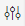

<!-- loio5aeb56cba39e4df4ae62b43a0dc2fad4 -->

# Create Calculation Views

Use a graphical editor to create calculation views that depict complex business scenarios.

## Context

Calculation views combine data from various sources. You can combine multiple transaction tables in a calculation view. You can also create calculation views to include layers of calculation logic.

## Procedure

1.  Create a calculation view.
2.  Start SAP Business Application Studio.

3.  To create a new project for the calculation view, do the following:

    1.  Locate and run the command *SAP Business Application Studio: New Project from Template*.

        You can use either of the following methods:

        -   In the *Welcome* tab, choose *Start from Template: Create a new project*.

        -   Press  [Crtl\] + [Shift\] + [P\]  \(or just [F1\]\) to display the command palette. In the command palette, type ***template***, then choose *SAP Business Application Studio: Create Project from Template* in the list of commands displayed.

    2.  Specify a target folder path.

    3.  Select the template *SAP HANA Database Project*, and choose *Start*.

    4.  Type a name for the new project \(for example, ***myApp***\).

    5.  Choose *Next* to retain all the proposed defaults.

    6.  Choose *Finish* to confirm.

4.  Create a new calculation view artifact.

     

    1.  Open the command palette.

        -   Press  [Crtl\] + [Shift\] + [P\]  or
        -   Press  [F1\]  or
        -   Choose *View* \> *Command Palette...*

    2.  Locate and run the command *SAP HANA: Create SAP HANA Database Artifact*.

        In the command palette, type ***data*** and choose *SAP HANA: Create SAP HANA Database Artifact* in the list of commands displayed.

    3.  In the application project's database module, select the folder `src` or a subfolder of `src`.

    4.  Select the database artifact **type**.

        In the selection box, type ***hdbc*** and choose *hdbcalculationview* in the list that appears.

    5.  Name the new calculation view.

        > ### Note:  
        > For calculation view names, only numbers, letters, underscores \(\_\), and hyphens \(-\) are permitted.

        The file suffix \(`.hdbcalculationview`\) is automatically appended to the name.

        > ### Tip:  
        > The file extension is mandatory. It is used to determine which HDI plug-in to call when creating the corresponding run-time object during application build or deployment. Calculation-view artifacts have the file extension `.hdbcalculationview`, for example, `myCalcView.hdbcalculationview`.

5.  Specify a data category.

    <table>
    <tr>
    <th valign="top">

    Data Category

    
    </th>
    <th valign="top">

    Description

    
    </th>
    </tr>
    <tr>
    <td valign="top">
    
        CUBE

    
    </td>
    <td valign="top">
    
        Specify whether to use a star join.

    
    </td>
    </tr>
    <tr>
    <td valign="top">
    
        DIMENSION

    
    </td>
    <td valign="top">
    
        Specify the dimension type STANDARD or TIME.

    
    </td>
    </tr>
    </table>
    
6.  Choose *Create*.

    To open your calculation view in the Calculation View Editor, click the newly created file in the selected folder.

7.  Continue modeling the calculation view by selecting view nodes from the tool palette and adding them to the view editor.

    Connect the nodes to model the data processing at runtime. To switch between any of the inner aggregation or projection nodes, right-click the node and select an option.

8.  Add data sources to a view node.

    1.  Select a view node.

    2.  Choose  \(Add Data Source\).

    3.  In *Find Data Sources*, select the type of the data source.

    4.  Enter a search string or the name of the data source, then select it from the list.

        Depending on the view node, you can add one or more data sources.

    5.  Choose *Finish*.

9.  \(Optional\) Add external objects \(from HDI or non-HDI schemas\) as a data source.

    You can use synonyms to access objects from HDI or non-HDI container schemas. If a synonym for a specific target object does not exist, you can create it during the dialog.

    > ### Note:  
    > You can access data sources that are not defined in your project by using services and synonyms. To use a service from the *Add Data Source* dialog, ensure that the service is listed in your `mta.yaml` file.
    > 
    > For more information, see *Consume Objects That are not Included in Your Development Project*.

    1.  Select a view node.

    2.  Choose  \(Add Data Source\).

        The *Find Data Sources* dialog box appears.

    3.  Under *Services*, select the required external service.

        To display the source service through which the object is accessible, select *Show Services*.

    4.  Search for the name of the target object that you want to access using the external service, then select it from the list.

        Depending on the selected view node, you can add one or more external data sources.

    5.  If a synonym for a specific target object does not exist, choose *Create Synonym*.

    6.  \(Optional\) If you have chosen to create a synonym, you can now modify its name and assign roles through the `.hdbgrants` files.

    7.  To assign roles through the `.hdbgrants` files, select *Generate .hdbgrants file*.

        <table>
        <tr>
        <th valign="top">

        In Field...

        
        </th>
        <th valign="top">

        Specify...

        
        </th>
        </tr>
        <tr>
        <td valign="top">
        
                *Object Owner Role*

        
        </td>
        <td valign="top">
        
                The name of the role to assign to the object owner \(ending in ***OO***\).

        
        </td>
        </tr>
        <tr>
        <td valign="top">
        
                *Application User Role*

        
        </td>
        <td valign="top">
        
                The name of the role to assign to the users that are running.

        For example, data previews from Business Application Studio.

        
        </td>
        </tr>
        </table>
        
        By default, the search results only contain the roles that are explicitly granted to the external service user with the option to grant the role \(in the view *EFFECTIVE\_ROLES*, the column *IS\_GRANTABLE* is ***TRUE***\). To display all the roles that the service user is authorized to see, select *Show all visible roles*.

        > ### Note:  
        > With these roles you can grant, for example, SELECT privileges with GRANT OPTION on the target object to the object owner, and SELECT privileges on the target object to the application user.

        For more information on roles for HDI containers, see *Roles \(.hdbrole\)* in the *SAP HANA Cloud Deployment Infrastructure \(HDI\) Reference*.

        For more information on roles for non-HDI containers, see the topic, *Enable Access to Objects in a Remote Classic Schema* in the *SAP HANA Cloud Deployment Infrastructure \(HDI\) Reference*.

    8.  Assign schemas.

        If *Generate .hdbgrants file* is selected, the options *Assign roles* and *Take default schema of service* are displayed.

        If *Take default schema of service* is not selected, schema inputs are displayed.

        This gives you the option to define the schema of the roles to be granted. If the role has no schema, leave the option unselected.

    9.  Choose *Finish*.

        The synonym is created.

        If a synonym for a specific target object does not exist, you can create it during the dialog.

10. Define output columns.

    1.  Select a view node.

    2.  In the editor toolbar, choose  \(Expand Details Panel\).

    3.  On the *Mapping* tab, select the column you want to add to the output.

    4.  In the context menu, choose *Add To Output*.

    5.  To add all columns in a data source to the output, choose *Select All* from the context menu of the data source, then select *Add To Output.*

11. Define attributes and measures.

    To successfully activate a calculation view with data category CUBE, you must specify at least one column as a measure.

    1.  Select the *Semantics* node.

    2.  On the *Columns* tab, select a column value.

    3.  In *Type*, select *Measure* or *Attribute*.

        If the data category is set to CUBE, an additional aggregation column is available to specify the aggregation type for measures.

12. Buildand deploy an SAP HANA Database Module.

    In the HANA project explorer, select the module and choose *Deploy*.

    The build process uses the design-time database artifacts to generate the corresponding actual objects \(runtime objects\) in the HDI container.

## Next Steps

After creating a calculation view, you can modify the output to your needs. The following table shows how you can modify the calculation view.

**Working With View Nodes**

<table>
<tr>
<th valign="top">

Requirement

</th>
<th valign="top">

Task to Perform

</th>
</tr>
<tr>
<td valign="top">

Query data from two data sources and combine records from both the data sources, based on a join condition, or to obtain language-specific data.

</td>
<td valign="top">

Create Joins

</td>
</tr>
<tr>
<td valign="top">

Combine the results of two or more data sources.

</td>
<td valign="top">

Create Unions

</td>
</tr>
<tr>
<td valign="top">

Partition the data for a set of partition columns, and perform an order by SQL operation on the partitioned data.

</td>
<td valign="top">

Create Rank Nodes

</td>
</tr>
<tr>
<td valign="top">

Perform intersect set operations on two data sources.

</td>
<td valign="top">

Use Intersect Set Operation

</td>
</tr>
<tr>
<td valign="top">

Perform minus set operations on two data sources.

</td>
<td valign="top">

Use Minus Set Operation

</td>
</tr>
<tr>
<td valign="top">

Model calculation views with SAP HANA hierarchy functions.

</td>
<td valign="top">

Hierarchy Functions

</td>
</tr>
<tr>
<td valign="top">

Model table functions in calculation views with both tabular input parameters and scalar input parameters.

</td>
<td valign="top">

Model Table Functions as View Nodes

</td>
</tr>
<tr>
<td valign="top">

Filter the output of view nodes.

</td>
<td valign="top">

Filter Output

</td>
</tr>
</table>

**Working With Columns**

<table>
<tr>
<th valign="top">

Requirement

</th>
<th valign="top">

Task to perform

</th>
</tr>
<tr>
<td valign="top">

Count the number of distinct values for a set of attribute columns.

</td>
<td valign="top">

Create Counters

</td>
</tr>
<tr>
<td valign="top">

Create new output columns and calculate their values at run time using an expression.

</td>
<td valign="top">

Create Calculated Columns

</td>
</tr>
<tr>
<td valign="top">

Assign semantic types to provide more meaning, and to attach information about the type of attributes and measures in calculation views.

</td>
<td valign="top">

Assign Semantics

</td>
</tr>
<tr>
<td valign="top">

Parameterize calculation views and execute them based on the values users provide at query run time.

</td>
<td valign="top">

Create Input Parameters

</td>
</tr>
<tr>
<td valign="top">

Filter the results based on the values that users provide to attributes at run time.

</td>
<td valign="top">

Assign Variables

</td>
</tr>
<tr>
<td valign="top">

Create level hierarchies to organize data in reporting tools.

</td>
<td valign="top">

Create Level Hierarchies

</td>
</tr>
<tr>
<td valign="top">

Create parent-child hierarchies to organize data in reporting tools.

</td>
<td valign="top">

Create Parent-Child Hierarchies

</td>
</tr>
<tr>
<td valign="top">

Associate measures with currency codes and perform currency conversions.

</td>
<td valign="top">

Associate Measures with Currency

</td>
</tr>
<tr>
<td valign="top">

Associate measures with unit of measures and perform unit conversions.

</td>
<td valign="top">

Associate Measures with Unit of Measure

</td>
</tr>
<tr>
<td valign="top">

Define data masking for column values when modeling a calculation view.

</td>
<td valign="top">

Mask Column Values in Client Tools

</td>
</tr>
<tr>
<td valign="top">

Define default values for columns \(both attributes and measures\).

</td>
<td valign="top">

Handle Null Values in Columns

</td>
</tr>
<tr>
<td valign="top">

Group related measures and related attributes together in a folder.

</td>
<td valign="top">

Group Related Measures and Attributes

</td>
</tr>
</table>

**Working With Calculation View Properties**

<table>
<tr>
<th valign="top">

Requirement

</th>
<th valign="top">

Task to perform

</th>
</tr>
<tr>
<td valign="top">

Filter the view data either using a fixed client value or using a session client set for the user.

</td>
<td valign="top">

Filter Data for Specific Clients

</td>
</tr>
<tr>
<td valign="top">

Discourage use of a calculation view.

</td>
<td valign="top">

Deprecate Calculation Views

For more information, see *Quick Reference: Calculation View Properties*.

</td>
</tr>
</table>

**Related Information**  

[Working With View Nodes](https://help.sap.com/viewer/460112ecd20e42c0a647979434b32412/2023_2_QRC/en-US/20ad4018a0ab4f2f84968beb8ab521e2.html "View nodes are the building blocks of calculation views.") :arrow_upper_right:

[Preview Calculation View Output](preview-calculation-view-output-903eff8.md "After you have modeled a calculation view, you can deploy it and preview its output.")

[Working With Attributes and Measures](https://help.sap.com/viewer/460112ecd20e42c0a647979434b32412/2023_2_QRC/en-US/8493c7f54a3b4b728821ecee972e2963.html "Attributes and measures form content data that you can use for data modeling.") :arrow_upper_right:

[Working With Calculation View Properties](https://help.sap.com/viewer/460112ecd20e42c0a647979434b32412/2023_2_QRC/en-US/9774a676c8fe46c79c5b197051fa9743.html "When you model calculation views, you can define certain properties that can be referenced at runtime.") :arrow_upper_right:

[Additional Functionality for Calculation Views](https://help.sap.com/viewer/460112ecd20e42c0a647979434b32412/2023_2_QRC/en-US/a19aa4797aea4eb0b402aef360a4e14f.html "After modeling a calculation view or during design time, you can use additional functions to better understand the performance of the view at runtime and to more efficiently model calculation views.") :arrow_upper_right:

[Create Calculation Views with Star Joins](https://help.sap.com/viewer/460112ecd20e42c0a647979434b32412/2023_2_QRC/en-US/988f5a9bd87c4492ad5c1e6f7936f0b5.html "Star joins connect a central data entity to multiple entities that are logically related. You can create a calculation view with star joins that join multiple dimensions to a single fact table.") :arrow_upper_right:

[Create Calculation Views with Time Dimension](https://help.sap.com/viewer/460112ecd20e42c0a647979434b32412/2023_2_QRC/en-US/5a787289ee7e4f7fad10f0f5dfd54646.html "You can add time dimensions to a calculation view by using the standard time-related tables as data sources in the calculation view.") :arrow_upper_right:

[Example: Using Keep Flag](https://help.sap.com/viewer/460112ecd20e42c0a647979434b32412/2023_2_QRC/en-US/f0e101a7641340708f0b098206210d9c.html "The Keep Flag option for attribute columns influences the result set of a calculation view.") :arrow_upper_right:

[Consume Objects That are not Included in Your Development Project](https://help.sap.com/viewer/460112ecd20e42c0a647979434b32412/2023_2_QRC/en-US/9c5e5d49af274281b74062a87d5cb34e.html "To consume objects that are not included in your project (or in your HDI container), you need to define synonyms that point to the objects to be consumed.") :arrow_upper_right:

[Quick Reference: Calculation View Properties](https://help.sap.com/viewer/460112ecd20e42c0a647979434b32412/2023_2_QRC/en-US/8a5d5228e41d4083b06e94d60756429b.html "Configure calculation view properties. The configured values determine the behavior of a calculation view at runtime.") :arrow_upper_right:

[Filter Data for Specific Clients](https://help.sap.com/viewer/460112ecd20e42c0a647979434b32412/2023_2_QRC/en-US/2175374c28a84f69ab125feb71a78ef7.html "Obtain data for all client values, or filter the calculation view data, either with a fixed client value or with the session client value of the query user.") :arrow_upper_right:

[Filter Output](https://help.sap.com/viewer/460112ecd20e42c0a647979434b32412/2023_2_QRC/en-US/d00c142746904c80a5730614f567a0a3.html "Apply filters on columns of nodes to filter their output.") :arrow_upper_right:

