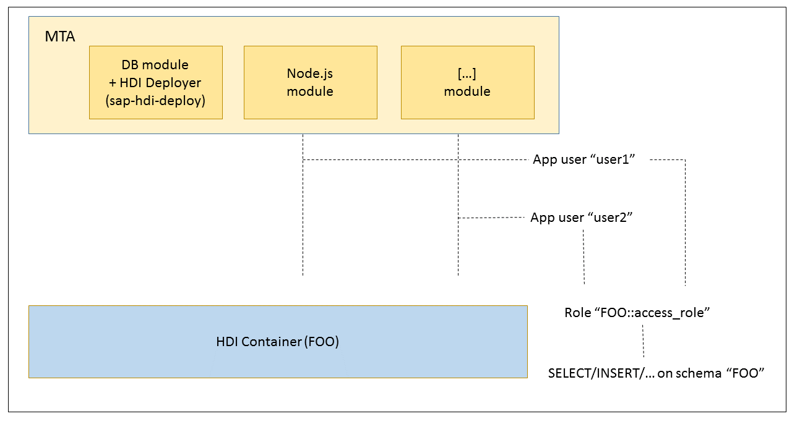

<!-- loio9235c9dd8dbf410f915ffe305296a032 -->

# The Default Access Role for HDI Containers

An overview of the access role required for HDI containers.

When an HDI container service instance is created by the SAP HANA Service Broker, for example, service instance “foo” with schema name “FOO”, the broker creates an HDI container named “FOO” \(consisting of the run-time schema “FOO” , the HDI metadata and API schema “FOO\#DI” , and the object owner “FOO\#OO”\) and, in addition, the following roles, which are assigned to the application user:

-   `FOO::access_role`

    A global access role for the run-time schema. This access role is assigned a set of default permissions for the run-time schema: `SELECT`, `INSERT`, `UPDATE`, `DELETE`, `EXECUTE`, `CREATE TEMPORARY TABLE`, and `SELECT CDS METADATA` on the run-time schema “FOO”.

-   `FOO::external_privileges_role`

    A role that grants the application user the privileges required for access to schemas and objects outside the HDI container, for example, the run-time schema “BAR”.

    By default, `external_privileges_role` has no privileges assigned. If the application user requires access to external objects, a user with grant-option privileges on those external objects must first explicitly grant the required privileges to the `external_privileges_role`. Similarly, any assigned privileges must also be explicitly revoked.

> ### Note:  
> The roles exist as long as the HDI container exists; they are not lost when the application binding user changes. New binding users are automatically assigned these roles by the broker.

Every time the service instance is bound to an application, the service broker creates two new users that are specific to this binding. The first user is the application user who is named user in the instance's credentials. This user is used by the application to access the HDI container's run-time schema “FOO”. This user is assigned the service instance's global access role “`FOO::access_role`” and the role “`FOO::external_privileges_role`”. The second user is the HDI API user - named “`hdi_user`” in the credentials. This user is equipped with privileges for the container's APIs in the “FOO\#DI” schema.

The following diagram illustrates the binding-specific application users and the role of the global access role:

> ### Note:  
> For the sake of simplicity, the HDI API users and the bindings for the HDI Deployer are not shown in this diagram.

To assign roles from the HDI content to the application-binding-specific users \(the users specified in <code>“user”:</code>\), the HDI Deployer implements an automatic assignment of the “`default_access_role`” role if it is present in the deployed content.

If a role definition file exists at the path `src/defaults/default_access_role.hdbrole`, and this file defines a role named “`default_access_role`”, and this file is included in the deployment \(for example, it is **not** excluded by means of an include filter\), then the HDI Deployer grants the deployed “`default_access_role`” role to the service instance's global access role \(for example, “`FOO::access_role`”\). In addition, the HDI Deployer revokes all default permissions `SELECT`, `INSERT`, `UPDATE`, `DELETE`, `EXECUTE`, `CREATE TEMPORARY TABLE`, and `SELECT CDS METADATA` on the run-time schema “FOO”\) from the global access role.

> ### Note:  
> If you use a `.hdinamespace` file in `src/` which defines a real name-space prefix for sub folders, then you need to put a `.hdinamespace` file with the empty name space “name”: " at `src/defaults/` to ensure that the role can be named `default_access_role`.

The following diagram illustrates the binding-specific application users, the role of the global access role, and the container-specific default access role:

> ### Note:  
> The “`default_access_role`” is assumed to be an “umbrella” role which aggregates other roles.

<a name="loio9235c9dd8dbf410f915ffe305296a032__section_rqn_r4v_23b"/>

## The Development Debug Role

Similarly to the `default_access_role`, a `development_debug_role` can be used to grant additional privileges to the default access role.

> ### Note:  
> This development debug role is only intended for HDI development and debugging; it is not intended \(or recommended\) for use in a productive environment.

If a role-definition file exists at the path `src/defaults/development_debug_role.hdbrole`, and this file defines a role named `development_debug_role`, and this file is explicitly included in the deployment by means of the `--deploy` option, then the HDI Deployer grants the deployed `development_debug_role` role to the service instance's global access role \(for example, `FOO::access_role`\). In order to remove the privileges granted this way, the design-time, role-definition file has to be undeployed.

> ### Note:  
> For more information about defining design-time roles, for example, in `.hdbrole` artifacts, see *HDI Artifact Types and Build Plug-ins* in *Related Information* below.

**Related Information**  

[Configuring the HDI Deployer](configuring-the-hdi-deployer-d5bf65e.md "Set up and use the Node.js-based HDI Deployer in Cloud Foundry.")

[Integrate the HDI Deployer into a Mutlitarget Application's Database Module](integrate-the-hdi-deployer-into-a-mutlitarget-application-s-database-modu-0194390.md "Install the HDI Deployer for use by a Multi-Target Application (MTA).")

[File Structure of the Multitarget Application Database Module](file-structure-of-the-multitarget-application-database-module-18ac9fd.md "The structure and hierarchy required in the database module of a multitarget application.")

[HDI Delta Deployment and Undeploy Allow List](hdi-delta-deployment-and-undeploy-allow-list-ebb0a1d.md "The HDI Deployer implements a delta-based deployment strategy including an optional allow list.")

[HDI Artifact Type and Build Plug-ins](../110-HANA-Cloud-DB-Dev-HDI-Plugins/hdi-artifact-type-and-build-plug-ins-f8618f7.md "The SAP HANA Cloud, design-time database artifact types, for example, tables and views, are mapped to an SAP HDI build plug-in.")

