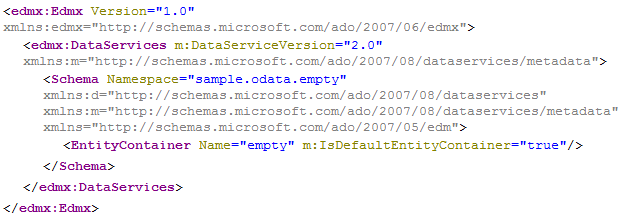

<!-- loio51d401d204a54909abebcca6d0a8e058 -->

# OData Empty Service

An OData service for SAP HANA XS is defined by a text file containing at least the following line:

Service definition `sample.odata:empty.xsodata`

```
 service {}  
```

A service file with the minimal content generates an empty, completely operational OData service with an empty service catalog and an empty metadata file:

> ### Note:  
> -   Examples and graphics are provided for illustration purposes only; some URLs may differ from the ones shown.

`http://<myHANAServer>:<port>/odata/services/<myService>.xsodata`

```
{
  "d" : {
    "EntitySets" : []
  }
}

```

`http://<myHANAServer>:<port>/odata/services/<myService>.xsodata/$metadata` 

  

An empty service metadata document consists of one `Schema` containing an empty `EntityContainer`. The name of the `EntityContainer` is the name of the`.xsodata` file, in this example "`empty`".

