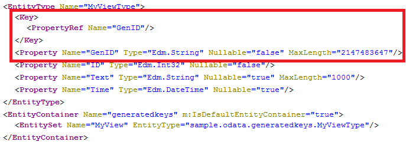

<!-- loioe86a01a7699a46528624d44678d37ea5 -->

# OData Key Specification

The OData specification requires an `EntityType` to denote a set properties forming a unique key. In HANA only tables may have a unique key, the primary key. For all other \(mostly view\) objects you need to specify a key for the entity.

In OSDL, you can specify a key for an entity/object by denoting a set of existing columns or by generating a key.

> ### Note:  
> Key attributes are not evaluated.

For the examples illustrating key specification, we use the following SQL view, which selects all data from the specified table.

View definition `sample.odata:view.hdbview`

```
{
	VIEW "sample.odata::view" as select * from "sample.odata::table"
 }
```


<a name="loioe86a01a7699a46528624d44678d37ea5__section_N1002A_N1000E_N10001"/>

## Existing Key Properties

If the object has set of columns that may form a unique key, you can specify them as key for the entity. These key properties are always selected from the database, no matter if they are omitted in the `$select` query option. Therefore explicit keys are not suitable for calculation views and analytic views as the selection has an impact on the result.

Service definition `sample.odata:explicitkeys.xsodata/$metadata`

```
 service {
	 "sample.odata::view" as "MyView" key ("ID","Text"); 
}  
```

The metadata document for the exposure of the view above is almost equal to the metadata document for repository objects. Only the key is different and consists now of two columns:

> ### Note:  
> Examples and graphics are provided for illustration purposes only; some URLs may differ from the ones shown.

 `http://<myHANAServer>:<port>/odata/services/<myService>.xsodata/$metadata` 


> ### Caution:  
> The OData infrastructure cannot check whether your specified keys are unique, so be careful when choosing keys.


<a name="loioe86a01a7699a46528624d44678d37ea5__section_N10058_N1000E_N10001"/>

## Generated Local Key

For objects that do not have a unique key in their results, for example, calculation views or aggregated tables, you can generate a locally valid key. This key value numbers the results starting with `1` and is not meant for dereferencing the entity; you cannot use this key to retrieve the entity. The key is valid only for the duration of the current session and is used only to satisfy OData's need for a unique ID in the results. The property type of a generated local key is `Edm.String` and cannot be changed.

Service definition `sample.odata:generatedkeys.xsodata`

```
service {
    "sample.odata::view" as "MyView" key generate local "GenID";
}

```

`http://<myHANAServer>:<port>/odata/services/<myService>.xsodata/$metadata` 



As a consequence of the transient nature of generated local keys, it is not possible to define navigation properties on these entities or use them in filter or order by conditions.

