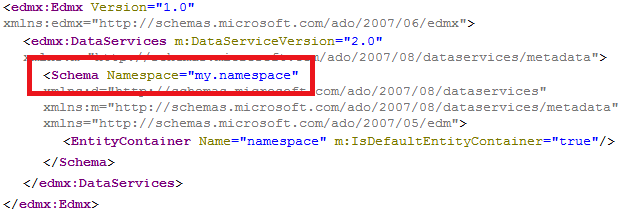

<!-- loiof9f5f227e9f54cea9d9548c97860b7c0 -->

# OData Namespace Definition

Every `.xsodata` file must define it's own namespace by using the `namespace` keyword:

Service definition `sample.odata:namespace.xsodata`

```
 service namespace "my.namespace" {}  
```

The resulting service metadata document has the specified schema namespace:

> ### Note:  
> Examples and graphics are provided for illustration purposes only; some URLs may differ from the ones shown.

`http://<myHANAServer>:<port>/odata/services/<myService>.xsodata/$metadata`



