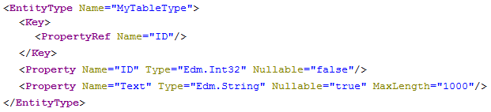

<!-- loio471609f56e354fe1b8f8e65b183202fa -->

# OData Property Projection

If the object you want to expose with an OData service has more columns than you actually want to expose, you can use SQL views to restrict the number of selected columns in the `SELECT`.

Nevertheless, SQL views are sometimes not appropriate, for example with calculation views, and for these cases we provide the possibility to restrict the properties in the OData service definition in two ways. By providing an including or an excluding list of columns.


<a name="loio471609f56e354fe1b8f8e65b183202fa__section_N1001D_N1000E_N10001"/>

## Including Properties

You can specify the columns of an object that have to be exposed in the OData service by using the with keyword. Key fields of tables must not be omitted.

Service definition `sample.odata:with.xsodata`

```
 service {
	 "sample.odata::table" as "MyTable" with ("ID","Text");
 }  
```

The resulting `EntityType` then contains only the properties derived from the specified columns:

> ### Note:  
> Examples and graphics are provided for illustration purposes only; some URLs may differ from the ones shown.

`http://<myHANAServer>:<port>/odata/services/<myService>.xsodata/$metadata`




<a name="loio471609f56e354fe1b8f8e65b183202fa__section_N10045_N1000E_N10001"/>

## Excluding Properties

The opposite of the `with` keyword is the `without` keyword, which enables you to specify which columns you do NOT want to expose in the OData service:

Service definition `sample.odata:without.xsodata`

```
 service { 
	"sample.odata::table" as "MyTable" without ("Text","Time"); 
}  
```

The generated `EntityType` then does NOT contain the properties derived from the specified columns:

`http://<myHANAServer>:<port>/odata/services/<myService>.xsodata/$metadata` 


