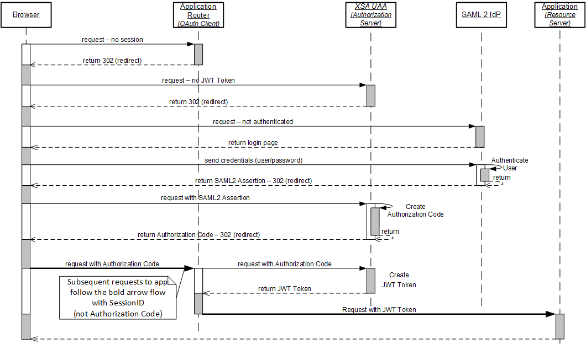

<!-- loiobcf95f78ce254b42bbe1efc4d29c0f24 -->

# Identity, Authentication, and Authorization

Understand the difference between user identity, authentication, and authorization.

To enable access to a multitarget application, and ensure this access is only granted to those people who can identify themselves and have the required authorization, it is important to ensure that the application can perform the following, basic, security-related tasks:

1.  Identify a user.

    Retain user data for use during the identification process and distinguish between users by a unique ID, for example, with user name, e-mail address, etc.

2.  Authenticate a user.

    Establish and prove the identity of a user based on a user-secret that is known to the application, for example, a password, a security certificate, a token, or Single Sign-On \(SSO\)

3.  Assign authorizations to a user.

    Grant the defined authorizations to users who can identify and authenticate themselves and enforce the granted authorities according to defined system-usage policies.

> ### Note:  
> How this functionality is provided differs according to the context in which the application is running, for example, on-premise of in the Cloud.

Today, the Internet enables us to use a huge variety of devices running multiple applications powered by different platforms. Despite the complexity, it is imperative that everything is able to interact securely, for example, so that logon is simplified and, as a result, security can be increased. This interaction requires protocols and technology that enable secure authentication and authorization between a wide variety of components all over the Internet, for example: desktop devices, mobile devices, or Web-based applications. The problems caused by these competing requirements are addressed using the concept of Federated Identity, or distributed identity management.

<a name="loiobcf95f78ce254b42bbe1efc4d29c0f24__section_vhw_2k2_jbb"/>

## Distributed Identity Management

Federated identity is the concept of linking and reusing electronic user identities across multiple identity-management systems and, as a result, freeing applications from the need to obtain and store a user´s credentials in order to be able to authenticate them on demand. Instead, the application can be configured to use an independent and central identity-management system that stores the user´s electronic identity, provided of course that the application is configured to trust the used identity-management system. This central identity-management system enables you to centralize authentication and authorization functionality. Federated Identity lead to the development of the following major protocols which are also supported by SAP multitarget applications:

-   SAML 2.0 \(authentication\)
-   OAuth 2.0 \(authorization\)

  
  
<a name="loiobcf95f78ce254b42bbe1efc4d29c0f24__fig_xk5_wym_jbb"/>OAuth 2.0 Authentication and Authorization Flow

  

### Authentication with SAML 2.0

The Security Assertion Markup Language \(SAML 2.0\) is an XML-based open standard used to facilitate the exchange of authentication and authorization data of a principal \(user\) between an Identity Provider \(IdP\) and a Service Provider \(SP\). The exchange of date is performed with messages called "Bearer Assertions", where the "Bearer" is any party in possession of the SAML assertion. The integrity of the assertion is protected by means of XML encryption and an XML signature.

SAML addresses the requirement for Web browsers to enable and facilitate Single Sign-On \(SSO\) on the Internet. Authorizations are expressed through "User-Groups" to which the principal is assigned to. It is up to the service provider and the respective implementation how the User-Groups are interpreted and the information translated into specific authorizations.

### Authorization with OAuth 2.0

The OAuth 2.0 authorization framework is a protocol for delegating authorizations; it is not for use as an authentication mechanism. The OAuth 2.0 specifies the following basic roles:

-   Resource Owner 

    Typically, the end-user; the OAuth resource owner can grant access to a protected resource.

-   Resource Server

    Typically a Cloud applications or microservice - hosts protected resources \(REST endpoints\). The OAuth resource server uses access tokens to accept \(and respond to\) requests for protected resources.

-   Client

    Typically an `approuter`; an OAuth client is an application that sends requests for protected resources on behalf \(and with the authorization\) of the resource owner.

-   Authorization server

    In Cloud Foundry, typically the XS User Account and Authentication \(UAA\) service. The OAuth Authorization Server issues access tokens for the OAuth client to obtain the authorizations of the OAuth resource owner after the client has been successfully authenticated by a SAML 2.0 compliant identity provider. An access token includes and represents the credentials used to access protected resources.

### JSON Web Tokens

The JSON Web Token \(JWT\) is an open standard that defines a format that can be used for securely transmitting information between parties as a JSON object. The information included in the token can be verified and trusted because it is digitally signed. A JWT can be signed using a secret key \(for example, using the HMAC algorithm\) or a public-private key pair, for example, using the RSA algorithm, the de-facto standard for industrial-strength encryption.

In the context of Cloud Foundry, the JSON token is digitally signed with the private key of the Authorization Server \(UAA\). In addition to the header, the token contains information specifying the issuer, the subject, the expiration time, and any additional custom information required by the consumer.

In the context of Cloud Foundry on SAP Business Technology Platform, developers writing business applications can validate the JWT token using the SAP Container Security API. You can also use the Security API to obtain user information, for example: logon name \(`getLogonName`\) or e-mail address \(`getEmail`\). The Security API also includes functions that enable you to check authorization scopes \(`checkScope`\), get the identity zone \(`getIdentityZone`\), get authentication attributes \(`getAttribute`\), and obtain tokens for use when authentication at the database is required \(`getHdbToken`\).

> ### Tip:  
> The Security API is included in both the SAP Node.js package `@sap/xssec`, which is available on the public NPM registry, and the open-source Java security client `java-security` FOR SAP Business Technology Platform, which is available on GitHub and on Maven Central. For more details, see *Related Information* below..

**Related Information**  

[Application Security Tools and Components](application-security-tools-and-components-a004e4f.md "Setting up security for multitarget applications involves multiple tasks and multiple tools and components.")

[Set up Authentication for an SAP Multitarget Application](set-up-authentication-for-an-sap-multitarget-application-21a9831.md "Define the authentication model for your multitarget application.")

[Set up Generic Authorization for a Multitarget Application](set-up-generic-authorization-for-a-multitarget-application-c8c578e.md "Define an authorization model for your multitarget application and configure generic authorization for any application end point (route path).")

[Standard SAP Node.js Packages](../060-HANA-Cloud-DB-Dev-App-Code/standard-sap-node-js-packages-5451327.md "A collection of Node.js packages developed by SAP is provided to help you develop Node.js applications for Cloud Foundry and SAP HANA Cloud.")

[SAP CP Java Security Library \(GitHub\)](https://github.com/SAP/cloud-security-xsuaa-integration/tree/master/java-security#configuration)

[Maven Central Repository](https://mvnrepository.com/search?q=SAP&d=com.sap)

