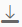

<!-- loio903eff885ebd4c5cadb1e0c3e58f681d -->

# Preview Calculation View Output

After modeling calculation views based on your requirements, you can deploy them and preview their output.

## Context

You can preview output data of calculation views in simple tabular format, or you can preview output data in graphical representations such as, bar graphs, area graphs, and pie charts. If your calculation view is defined with hierarchies, and the hierarchies are deployed as SQL hierarchy views, the tool allows you to preview the output data in hierarchical representations.

You can also export and download the output data to `.csv` files. The tool also allows you to preview the SQL query that the tool executed to fetch the output data.

## Procedure

1.  Start SAP Web IDE Full-Stack.

2.  In the *Workspace* view, select the required calculation view to preview its output.

3.  In the context menu, choose *Data Preview*.

4.  Provide an input parameter or variable value.

    If you have defined any input parameters in the calculation view, provide the required input parameter values as follows:

    1.  Select the required operator.

    2.  Provide values for the *From* and *To* fields based on the selected operator.

    3.  In the toolbar, choose  \(Open Content\).

        In the *Raw Data* tab, the tool displays the output data in tabular format.

5.  \(Optional\) Apply filters.

    1.  If you want to apply filters on columns and preview the filtered output data, in the toolbar, choose  \(Add Filter\).

    2.  Choose *Add Filters*.

    3.  Select the required columns and define the filter conditions.

    4.  Choose *Apply*.

6.  Export output data, if required.

    If you want to export the raw data output to a .csv file, perform the following steps:

    1.  In the toolbar, choose  \(Download\).

    2.  In the *Delimiter* drop-down list, select the required delimiter that the tool must use to separate the values in the `.csv` file.

    3.  Choose *Download*.

7.  View the SQL query used by the calculation view, if required.

    1.  To view the SQL query that the tool executed to fetch the data, in the toolbar, choose *SQL*.

    2.  To view, edit and execute the SQL query in SQL editor, choose  \(Edit SQL Statement in SQL Console\).

8.  Preview the output of a calculation view in graphical format.

    You can preview the output of a calculation view as a bar graph, an area graph, a pie chart, or as a table chart, as well as in other graphical representations. These graphical representations allow more detailed analysis of output data.

    1.  In the menu bar, choose *Analysis*.

    2.  Configure the axis values by dragging and dropping the required attributes and measures to the *Label Axis* and the *Value Axis*.

        The tool displays the output data in graphical representation. Select the required chart icons in the menu to view the output in different graphical representation.

    3.  In the toolbar, choose  \(Display Settings\) to toggle legends and values.

    4.  If you want to view the query SQL query that the tool executed to fetch the data for the provided axes configurations, in the toolbar, choose *SQL*.

    5.  If you want to export the charts as `.png` files to your local system, in the toolbar, choose  \(Download\) and select *Chart*.

    6.  If you want to export the raw output data as `.csv` files to your local system, in the toolbar, choose  \(Download\) and select *Data*.

9.  Preview output of hierarchies.

    The SAP Database Explorer provides a *Hierarchies* tab to preview output of calculation views that contain hierarchies. If you have defined any hierarchies in calculation views of type Dimension or Cube, you can preview output in hierarchical tree structures.

    > ### Note:  
    > SAP Database Explorer does not support preview output of compound parent-child hierarchies in calculation views.

    1.  In the menu bar, choose the *Hierarchies* tab.

        The *Available Objects* pane displays all the hierarchies defined in the calculation view including hierarchies from shared dimensions. It also displays the measures defined in the calculation view.

    2.  Drag and drop a hierarchy to the *Selected Hierarchy* pane.

        > ### Restriction:  
        > The tool does not support preview of multiple hierarchies at the same time. You can preview output in hierarchical tree structure of only one hierarchy at a time.

    3.  \(Optional\) If you want to preview the output with one or more measures from the calculation view, drag and drop the measure to the *Selected Measure\(s\)* pane.

        The tool constructs the output data in hierarchical tree structure for the selected configuration. The root node is expanded and the number of records displayed depends on the SQL console settings.

    4.  If you are previewing output of a calculation view \(type dimension\) and if you want to view the SQL query that the tool executed on the tables to fetch the output data, in the toolbar, choose *SQL*.

    5.  To export the output data to a `.csv` file, in the toolbar, choose  \(Download\).

10. Preview output of intermediate nodes.

    If you have activated the calculation view, you can also preview the output of any of its intermediate view nodes. This preview helps know the output data that is passed to the higher view node levels.

    1.  Switch to the *Development* perspective.

    2.  In the *Workspace* view, select the required calculation view and open it in the view editor.

    3.  Right-click the required intermediate view node and choose *Data Preview*.

**Related Information**  

[Create Calculation Views](create-calculation-views-5aeb56c.md "Use a graphical editor to create calculation views that depict a complex business scenario.")

