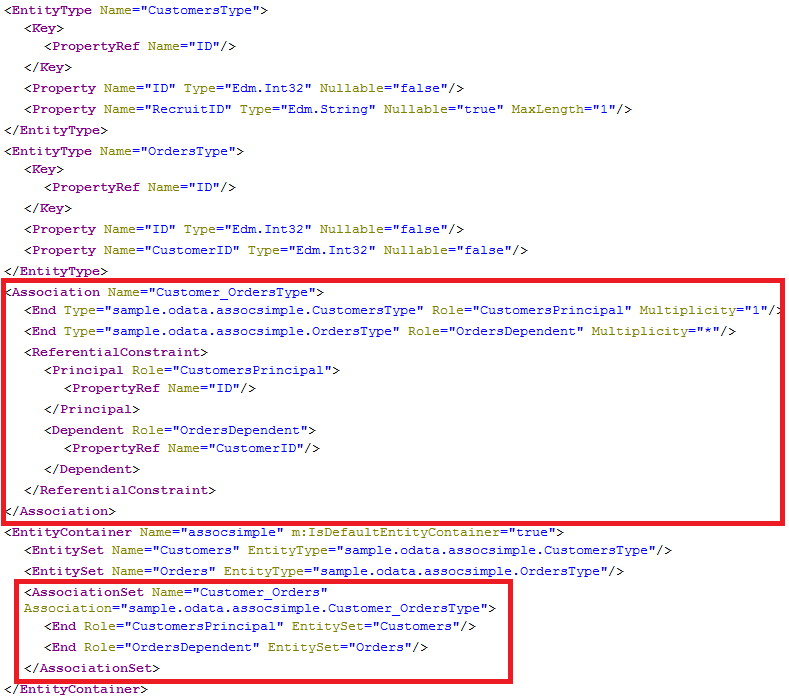
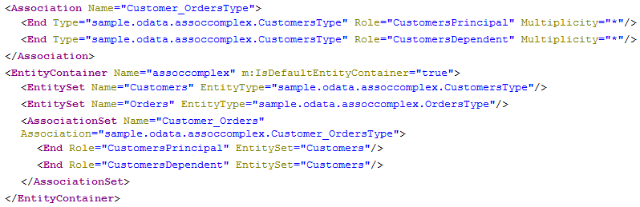

<!-- loio595f0a124602449695bf15711032186c -->

# OData Associations

You can define associations between entities to express relationships between entities. With associations it is possible to reflect foreign key constraints on database tables, hierarchies and other relations between database objects. OSDL supports simple associations, where the information about the relationship is stored in one of the participating entities, and complex associations, where the relationship information is stored in a separate association table.

Associations themselves are freestanding. On top of them you can specify which of the entities participating in the relationship can navigate over the association to the other entity by creating `NavigationProperty` objects.

For the examples used to illustrate OData associations, we use the tables `customer` and `order`:

Table definition: `sample.odata:customer.hdbtable`

```
COLUMN TABLE "sample.odata::customer" (
	"ID" INTEGER NOT NULL,
	"OrderID" INTEGER,
	PRIMARY KEY ("ID")
);  
```

Table definition: `sample.odata:order.hdbtable`

```
COLUMN TABLE "sample.odata::order" (
	"ID" INTEGER NOT NULL,
	"CustomerID" INTEGER,
	PRIMARY KEY ("ID")
);  
```

There is one relationship `order.CustomerID` to `customer.ID`.


<a name="loio595f0a124602449695bf15711032186c__section_N10055_N1000E_N10001"/>

## Simple Associations

The definition of an association requires you to specify a name, which references two exposed entities and whose columns keep the relationship information. To distinguish the ends of the association, you must use the keywords `principal` and `dependent`. In addition, it is necessary to denote the multiplicity for each end of the association.

Service definition: `sample.odata:assocsimple.xsodata`

```
service {
	"sample.odata::customer" as "Customers"; 
	"sample.odata::order" as "Orders";
    association "Customer_Orders" with referential constraint principal "Customers"("ID") multiplicity "1" dependent "Orders"("CustomerID") multiplicity "*"; 
}  
```

The association in the example above with the name `Customer_Orders` defines a relationship between the table `customer`, identified by its `EntitySet` name `Customers`, on the `principal` end, and the table `order`, identified by its entity set name `Orders`, on the `dependent` end. Involved columns of both tables are denoted in braces \(\{\}\) after the name of the corresponding entity set. The `multiplicity` keyword on each end of the association specifies their cardinality - in this example, one-to-many.

The `with referential constraint` syntax ensures that the referential constraint check is enforced at design time, for example, when you activate the service definition in the SAP HANA repository. The referential constraint information appears in the metadata document.

> ### Note:  
> SAP strongly recommends that you use the `with referential constraint` syntax.

The number of columns involved in the relationship must be equal for both ends of the association, and their order in the list is important. The order specifies which column in one table is compared to which column in the other table. In this simple example, the column `customer.ID` is compared to `order.CustomerID` in the generated table join.

As a result of the generation of the service definition above, an `AssociationSet` named `Customer_Orders` and an `Association` with name `Customer_OrdersType` are generated:

 `http://<myHANAServer>:<port>/odata/services/<myService>.xsodata/$metadata` 



The second association is similar to the first one and is shown in the following listing:

```
 association "Customer_Recruit" with referential constraint principal "Customers"("ID") multiplicity "1" dependent "Customers"("RecruitID") multiplicity "*";  
```


<a name="loio595f0a124602449695bf15711032186c__section_N100CC_N1000E_N10001"/>

## Complex Associations

For the following example of a complex association, an additional table named `knows` is introduced that contains a relationship between customers.

Table definition: `sample.odata:knows.hdbtable`

```
COLUMN TABLE "sample.odata::knows" (
	"KnowingCustomerID" INTEGER NOT NULL,
	"KnowCustomerID" INTEGER NOT NULL,
	PRIMARY KEY ("KnowingCustomerID","KnowCustomerID")
);  
```

Relationships that are stored in association tables such as `knows` can be similarly defined as simple associations. Use the keyword `over` to specify the additional table and any required columns.

Service definition: `sample.odata:assoccomplex.xsodata`

```
service {
	"sample.odata::customer" as "Customers"; 
	"sample.odata::order" as "Orders";
    association "Customer_Orders" 
        principal "Customers"("ID") multiplicity "*" 
        dependent "Customers"("ID") multiplicity "*"
        over "sample.odata::knows" principal ("KnowingCustomerID") dependent ("KnownCustomerID"); 
}  
```

With the keywords `principal` and `dependent` after `over` you can specify which columns from the association table are joined with the `principal` respectively dependent columns of the related entities. The number of columns must be equal in pairs, and their order in the list is important.

The generated `Association` in the metadata document is similar to the one created for a simple association except that the `ReferentialConstraint` is missing:

`http://<myHANAServer>:<port>/odata/services/<myService>.xsodata/$metadata`




<a name="loio595f0a124602449695bf15711032186c__section_N10120_N1000E_N10001"/>

## Navigation Properties

By only defining an association, it is not possible to navigate from one entity to another. Associations need to be bound to entities by a `NavigationProperty`. You can create them by using the keyword `navigates`:

Service definition: `sample.odata:assocnav.xsodata` 

```
service { 
	"sample.odata::customer" as "Customers" navigates ("Customer_Orders" as "HisOrders"); 
	"sample.odata::order" as "Orders";
    association "Customer_Orders" principal "Customers"("ID") multiplicity "1" dependent "Orders"("CustomerID") multiplicity "*"; 
}  
```

The example above says that it is possible to navigate from `Customers` over the association `Customer_Order` via the `NavigationProperty` named "`HisOrders`".

The right association end is determined automatically by the entity set name. But if both ends are bound to the same entity, it is necessary to specify the starting end for the navigation. This is done by specifying either `from principal` or `from dependent` which refer to the `principal` and `dependent` ends in the association.

Service definition: `sample.odata:assocnavself.xsodata` 

```
service { 
	"sample.odata::customer" as "Customers" 
		navigates ("Customer_Orders" as "HisOrders","Customer_Recruit" as "Recruit" from principal); 
	"sample.odata::order" as "Orders";
    association "Customer_Orders" principal "Customers"("ID") multiplicity "1" dependent "Orders"("CustomerID") multiplicity "*";
		association "Customer_Recruit" principal "Customers"("ID") multiplicity "1" dependent "Customers"("RecruitID") multiplicity "*"; 
}  
```

In both cases a `NavigationProperty` is added to the `EntityType`.

 `http://<myHANAServer>:<port>/odata/services/<myService>.xsodata/$metadata` 


