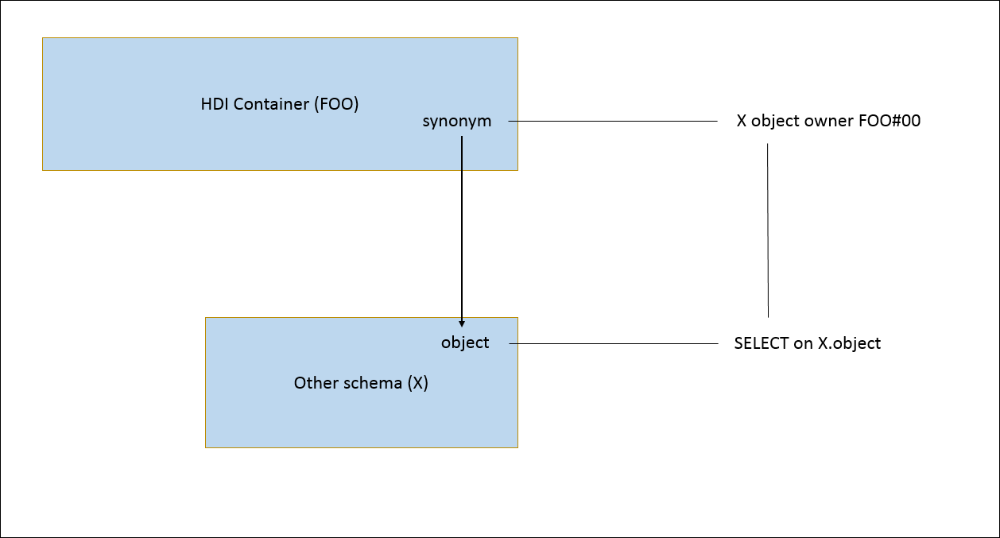

<!-- loio4457f759107d4985bd80532c9e023227 -->

# SAP HDI Security in the Context of Cloud Foundry

An overview of the security considerations to bear in mind when enabling SAP HDI for use in the context of Cloud Foundry.

In the context of Cloud Foundry, SAP HDI provides a service that enables you to deploy database development artifacts such as tables, views, and procedures to HDI containers. The deployment process populates the database run-time with the corresponding catalog objects. In addition to database artifacts, HDI also enables you to import and export table content such as business configuration data and translatable texts. This section includes security-related information about the following Cloud Foundry components:

-   [The SAP HDI Deployer](sap-hdi-security-in-the-context-of-cloud-foundry-4457f75.md#loio4457f759107d4985bd80532c9e023227__section_ow1_khz_ngb)
-   [The SAP HDI SQL API](sap-hdi-security-in-the-context-of-cloud-foundry-4457f75.md#loio4457f759107d4985bd80532c9e023227__section_ojj_nhz_ngb)
-   [SAP HDI Containers](sap-hdi-security-in-the-context-of-cloud-foundry-4457f75.md#loio4457f759107d4985bd80532c9e023227__section_ekd_njz_ngb)
-   [SAP HDI Users in Cloud Foundry](sap-hdi-security-in-the-context-of-cloud-foundry-4457f75.md#loio4457f759107d4985bd80532c9e023227__section_mdv_ljz_ngb)
-   [SAP HDI Roles in Cloud Foundry](sap-hdi-security-in-the-context-of-cloud-foundry-4457f75.md#loio4457f759107d4985bd80532c9e023227__section_k5f_1tn_vgb)
-   [SAP HDI Data Storage in Cloud Foundry](sap-hdi-security-in-the-context-of-cloud-foundry-4457f75.md#loio4457f759107d4985bd80532c9e023227__section_djd_vlz_ngb)


<a name="loio4457f759107d4985bd80532c9e023227__section_ow1_khz_ngb"/>

## The SAP HDI Deployer

For Cloud Foundry environments, the SAP HANA Deployment Infrastructure \(HDI\) includes a "Deployer", which is a Node application \(`@sap/hdi-deploy`\) that is included in a multitarget application \(MTA\) for the purpose of deploying an Cloud Foundry application's HDI database-related design-time artifacts to the application's corresponding HDI containers. The Node.js application `@sap/hdi-dynamic-deploy` enables the deployment of database artifacts to HDI containers that are created dynamically, too, for example, by the Cloud Foundry's Instance Manager.

By default, an HDI container is assigned very few database privileges. For example, the object owner \( “`#OO`” user\) is only assigned the `CREATE ANY` privilege on the container's run-time schema \(schema “FOO” for an HDI container “FOO”\). To access database objects inside other database schemata or other HDI containers, and to be able to deploy synonyms into the HDI container which point to objects outside the container, the object owner needs additional privileges. For example, for an object “`object`” in schema “X”, the `SELECT` privilege on “`X.object`” :




### The hdbgrants File

To assign privileges automatically to the object owner and \(or\) the application binding users, the HDI Deployer provides `.hdbgrants` files, which use a syntax that is similar to the `.hdbrole` artifact. The following example shows the structure of an `.hdbgrants` file:

> ### Code Syntax:  
> `granting-service.hdbgrants`
> 
> ```
> {
>   "granting-service": { 
>     "object_owner": { 
>       <privileges> 
>     }, 
>     "application_user": { 
>       <privileges> 
>     }
>   }
> } 
> ```

In the code example above, the top-level key <code>“granting-service”</code> defines the grantors: the names of the bound services which **grant** the privileges required by the various users. One level down, the keys <code>“object_owner”</code> and <code>“application_user”</code> define the grantees: the users to whom the privileges are granted. The <code>“object_owner”</code> key is used to specify the HDI container's object owner; the <code>“application_user”</code> key defines the application users who are bound to the application modules, for example, the Node.js module in a multitarget application. The keys at the third level define the set of roles and privileges to grant, using a structure that is similar to the format used in a `.hdbrole` role-definition file.

> ### Note:  
> For backwards compatibility, the suffix `.hdbsynonymgrantor` is also supported.

On startup, the HDI Deployer looks for files with the `.hdbgrants` suffix and processes them in the following way: For each grantor specified in the `.hdbgrants` file, the HDI Deployer looks up a bound service with the specified name \(subject to service replacements\), connects to the database with the service's credentials, and grants the specified privileges to the grantees.

> ### Code Syntax:  
> Example `cfg/SYS-access.hdbgrants` File with Some Privileges
> 
> ```
> {
>   "SYS-access": {
>     "object_owner": {
>       "object_privileges":[
>         {
>           "schema": "SYS",
>           "name": "VIEWS",
>           "privileges": ["SELECT"]
>         },
>         {
>           "schema": "SYS",
>           "name": "TABLES",
>           "privileges": ["SELECT"]
>         }
>       ]
>     },
>     "application_user": {
>       "object_privileges":[
>         {
>           "schema": "SYS",
>           "name": "VIEWS",
>           "privileges": ["SELECT"]
>         },
>         {
>           "schema": "SYS",
>           "name": "TABLES",
>           "privileges": ["SELECT"]
>         }
>       ]
>     }
>   }
> }
> 
> ```


### The hdbrevokes File

Starting with version 3.8, the HDI deployer enables the assignment of revoking rights. Any privileges that can be granted by means of the `.hdbgrants` file can be revoked with the `.hdbrevokes` file. The `.hdbgrants` and the `.hdbrevokes` file share the same structure.

> ### Note:  
> If both files exist, the `.hdbrevokes` file is processed before the `.hdbgrants` file.

> ### Code Syntax:  
> `revoking-service.hdbrevokes`
> 
> ```
> {
>   "revoking-service": { 
>     "object_owner": { 
>       <privileges> 
>     }, 
>     "application_user": { 
>       <privileges> 
>     }
>   }
> } 
> ```


<a name="loio4457f759107d4985bd80532c9e023227__section_ojj_nhz_ngb"/>

## The SAP HDI SQL API

In addition to the stand-alone deployer application, SAP HDI also provides an SQL application programming interface \(API\) that enables users and Cloud Foundry applications to create database objects at run time by generating design-time artifacts within the application and deploying them into their container using HDI tools. The HDI user `_SYS_DI` is the owner of all HDI SQL-based APIs, for example, all API procedures in the `_SYS_DI` schema and API procedures in HDI containers.


### Client Libraries for Cloud Foundry Applications

The client libraries for Node.js \(`@sap/hdi`\) and Java \(`sap-java-hdi`\) provide access to SAP HDI functionality by means of the SAP HDI's SQL APIs. Assuming the user `hdiUser` has the privileges required to access `_SYS_DI`, the client libraries `@sap/hdi` and `sap-java-hdi` can be used to connect to the SAP HANA database, configure HDI, create and drop HDI containers, configure container build plug-in libraries, and so on.


<a name="loio4457f759107d4985bd80532c9e023227__section_ekd_njz_ngb"/>

## SAP HDI Containers

The SAP HANA Deployment Infrastructure \(HDI\) uses so-called containers to store design-time artifacts and the corresponding deployed run-time \(catalog\) objects. The HDI makes a strict separation between design-time and run-time objects by introducing the following, distinct container types:

-   **Design-time** container \(DTC\)

    Provides an isolated environment for the storage of design-time files by means of a “work” and “deployed” file systems.

    > ### Restriction:  
    > For maximum isolation and increased security, content stored in a design-time container is owned by a dedicated technical user.

-   **Run-time** container \(RTC\)

    Stores the deployed objects built according to the specification stored in the corresponding design-time artifacts. The creation of a run-time container results in a new technical database user and a schema with the same name as the one chosen for the name of the run-time container itself. Access to content in the run-time container is controlled by database privileges, for example, by granting SELECT or EXECUTE privileges.


### The Default Access Role for HDI Containers

When an HDI container service instance is created by the SAP HANA Service Broker, for example, service instance “foo” with schema name “FOO”, the broker creates an HDI container named “FOO” \(consisting of the run-time schema “FOO” , the HDI metadata and API schema “FOO\#DI” , and the object owner “FOO\#OO”\) and, in addition, the following roles:

> ### Note:  
> The roles exist as long as the HDI container exists; the roles are not lost when the application's binding user changes. New binding users automatically receive these roles from the service broker.

-   `FOO::access_role`

    A global, default access role that equips the application user with privileges on the run-time schema “FOO”. This access role is assigned a set of default permissions for the run-time schema: `SELECT`, `INSERT`, `UPDATE`, `DELETE`, `EXECUTE`, `CREATE TEMPORARY TABLE`, and `SELECT CDS METADATA` on the run-time schema “FOO”.

-   `FOO::external_privileges_role`

    A global, default access role that equips the application user with privileges on schemas and objects outside the container, for example, “BAR”.


Every time the service instance is bound to an application, the service broker creates two new users that are specific to this binding. The first user is the application user who is named `"user"` in the instance's credentials. This user is used by the application to access the HDI container's run-time schema “FOO”. This user is assigned the service instance's global access role “`FOO::access_role`” and the role `FOO::external_privileges_role`. The second user is the HDI API user - named “`hdi_user`” in the credentials. This user is equipped with privileges for the container's APIs in the “FOO\#DI” schema.

The following diagram illustrates the binding-specific application users and the role of the global access role:

> ### Note:  
> For the sake of simplicity, the HDI API users and the bindings for the HDI Deployer are not shown in this diagram.


To assign roles from the HDI content to the application-binding-specific users \(the users specified in <code>“user”:</code>\), the HDI Deployer implements an automatic assignment of the “`default_access_role`” role if it is present in the deployed content.

If a role definition file exists at the path `src/defaults/default_access_role.hdbrole`, and this file defines a role named “`default_access_role`”, and this file is included in the deployment \(for example, it is **not** excluded by means of an include filter\), then the HDI Deployer grants the deployed “`default_access_role`” role to the service instance's global access role \(for example, “`FOO::access_role`”\). In addition, the HDI Deployer revokes all default permissions `SELECT`, `INSERT`, `UPDATE`, `DELETE`, `EXECUTE`, `CREATE TEMPORARY TABLE`, and `SELECT CDS METADATA` on the run-time schema “FOO”\) from the global access role.

> ### Note:  
> If you use a `.hdinamespace` file in `src/` which defines a real name-space prefix for sub folders, then you need to put a `.hdinamespace` file with the empty name space “name”: " at `src/defaults/` to ensure that the role can be named `default_access_role`.

The following diagram illustrates the binding-specific application users, the role of the global access role, and the container-specific default access role:


> ### Note:  
> The “`default_access_role`” is assumed to be an “umbrella” role which aggregates other roles.


### The Development Debug Role

Similarly to the `default_access_role`, a `development_debug_role` can be used to grant additional privileges to the default access role.

> ### Note:  
> This development debug role is only intended for HDI development and debugging; it is not intended \(or recommended\) for use in a productive environment.

If a role-definition file exists at the path `src/defaults/development_debug_role.hdbrole`, and this file defines a role named `development_debug_role`, and this file is explicitly included in the deployment by means of the `--deploy` option, then the HDI Deployer grants the deployed `development_debug_role` role to the service instance's global access role \(for example, `FOO::access_role`\). In order to remove the privileges granted this way, the design-time, role-definition file has to be undeployed.

> ### Note:  
> For more information about defining design-time roles, for example, in `.hdbrole` artifacts, see *Roles* in *Related Information* below.


<a name="loio4457f759107d4985bd80532c9e023227__section_mdv_ljz_ngb"/>

## SAP HDI Users in Cloud Foundry

HDI uses several container-specific technical users to separate the different container-related tasks such as creating the schemas, triggering deployment, and creating database objects for Cloud Foundry applications. The Cloud Foundry application's database objects are created during application deployment with a special container-specific technical system user, the container object owner \(the container’s “\#OO” user\). Unless explicitly granted such a privilege, this user has no access to the HDI container's metadata schema and especially not to the HDI API procedures. In this way, it is possible to prevent an application procedure with definer-mode security acquiring unwanted access to metadata and the deployment API. Run-time users need the corresponding access privileges only on the container schema.

> ### Note:  
> Cloud Foundry applications connect to HDI containers with container-specific, technical, run-time users. For more information about HDI users, their roles, and the scope of their access privileges, see *SAP HDI Users* in *Related Information* below.

The technical users listed in the following table are used in the context of Cloud Foundry to connect to the SAP HANA database with a specific set of conditions:


<table>
<tr>
<th valign="top">

User ID

</th>
<th valign="top">

Service

</th>
<th valign="top">

Type

</th>
<th valign="top">

Description

</th>
</tr>
<tr>
<td valign="top">

`BROKER_USER` 

</td>
<td valign="top">

SAP HANA Broker

</td>
<td valign="top">

Technical database user

</td>
<td valign="top">

Used by the broker to connect to SAP HANA and trigger any operations required to broker schemas or HDI containers

</td>
</tr>
<tr>
<td valign="top">

`BROKER_PO_USER` 

</td>
<td valign="top">

SAP HANA Broker

</td>
<td valign="top">

Technical database user

</td>
<td valign="top">

Used by the broker to manage users and user-roles, by means of stored procedures \(with `SQL SECURITY DEFINER`\).

> ### Note:  
> This user is only used to install the stored procedures it needs and is locked afterwards to prevent logon.


</td>
</tr>
</table>


<a name="loio4457f759107d4985bd80532c9e023227__section_k5f_1tn_vgb"/>

## SAP HDI Roles in Cloud Foundry

In a Cloud Foundry environment, role developers use the SAP Web IDE for SAP HANA to create the design-time version of roles within a project stored in the GIT repository. When the developer deploys the project, a run-time version of the roles is created in an HDI container \(schema\) within the SAP HANA database.

  
  
**Role Development in the SAP HANA Deployment Infrastructure \(HDI\)**

")


### Authorizations and HDI Role Development

The following users are involved in the creation and development of HDI roles:

-   The role developer
-   The owner of the HDI container \("container object owner"\)

The role developer must have the roles and role collections required to access the development tools, for example, SAP Web IDE Full-Stack, and to create and manage objects in the relevant development organization and space. For more information about the authorizations required for developing HDI roles, for example in `.hdbrole` artifacts, see the *SAP HANA Cloud, SAP HANA Database Developer Guide for Cloud Foundry Multitarget Applications \(SAP Business App Studio\)* in *Related Information*.

The deployment of database objects with the HDI is based on a container model where each container corresponds roughly to a database schema. Each schema, and the database objects deployed into the schema, are owned by the HDI container object owner, a dedicated technical database user with the name <code><i class="varname">&lt;container&gt;</i>#OO</code>. However, this user does not have any “external” privileges, for example, system privileges or object privileges, on objects in an HDI container in a different space to the role-development container or in an external schema. These privileges must be granted to the container object owner explicitly. If the container object owner does not have all privileges, role deployment will fail with a “missing authorization” error.

There are a number of ways of granting the required privileges to the container object owner. These range from simply granting the privileges to the container object owner directly to more sophisticated methods involving a user-provided service. The various alternatives are described in detail in the document *Best Practices and Recommendations for Developing Roles in SAP HANA* \(see Related Information\).

> ### Note:  
> The container object owner must always be granted privileges on external objects with the additional parameters `WITH ADMIN OPTION` or `WITH GRANT OPTION`.


### Granting and Revoking HDI Roles in Cloud Foundry

Roles deployed to an HDI container are granted and revoked by executing the procedures `GRANT_CONTAINER_SCHEMA_ROLES` and `REVOKE_CONTAINER_SCHEMA_ROLES` of either the container's or the container group's API. The container administrator and the container-group administrator are authorized to execute these procedures. For more information about these procedures and administrator roles, see *Maintaining SAP HDI Containers* in *Related Information*.

A role administrator \(a user with the system privilege `ROLE ADMIN`\) can also grant and revoke HDI roles, for example as follows:

<code>GRANT <i class="varname">&lt;role_schema_name&gt;</i>.<i class="varname">&lt;role_name&gt;</i> TO <i class="varname">&lt;user_name&gt;</i></code>

Where *<role\_schema\_name\>* is the name of the HDI container where the role was created.

> ### Tip:  
> Roles can also be granted and revoked using the SAP HANA cockpit.


### Dropping HDI Roles in Cloud Foundry

It is not possible to drop an HDI role by dropping the run-time version of the role, for example, using the SQL statement `DROP ROLE`. The role must be undeployed within the HDI container.


### Auditing HDI Roles in Cloud Foundry

When role objects are deployed for the first time, a run-time version of the role is created in the corresponding schema in the database using SQL. The same is true if roles are changed or undeployed. You can therefore audit activity related to HDI roles with audit actions `CREATE ROLE`, `ALTER ROLE`, and `DROP ROLE`.


<a name="loio4457f759107d4985bd80532c9e023227__section_djd_vlz_ngb"/>

## SAP HDI Data Storage in Cloud Foundry

In the context of Cloud Foundry, SAP HANA is exposed as a managed service with the service name “`hana`”. If a Cloud Foundry application is bound to an instance of the `hana` service, the credentials required to access SAP HANA are defined in the application's *<VCAP\_SERVICES\>* environment variable. Services are instantiated based on a “service plan”, one of which is specific to HDI: `hdi-shared`, which is described in more detail from the security perspective below.

> ### Output Code:  
> ```
> $ cf marketplace -s hana
>   
> Getting services from marketplace...
> Getting plans for service "hana"...
>  
> service plan   description                                     free/paid
> –––––––––––––––––––––--––––––––––––––––––––––––––––––––––––---––––––––--
> hdi-shared     An HDI container on an SAP HANA database        free
> schema         A schema on an SAP HANA database                free
> securestore    User with permissions to use the secure store   free
> ```


### The “hdi-shared” Service Plan

When you create a service instance with the service plan `hdi-shared` and bind it to a Cloud Foundry application, the application receives the credentials it needs for access to the application's corresponding HDI container: a database schema that is equipped with additional metadata. HDI containers are isolated from each other by means of schema-level access privileges. Cross-container access at the database level is prevented by default, but can be enabled by explicitly granting the necessary privileges, for example, using synonyms and the `hdbgrants` service. Within an SAP HANA database you can define an arbitrary number of HDI containers, and the same objects can be deployed multiple times into different HDI containers in the same SAP HANA database, for example, to install several instances of the same software product in the same SAP HANA database.

Database objects \(tables, views, procedures, and so on\) have an owner: the user who created the object. When the owner of a database object is deleted, all objects owned by the deleted user are removed from the database, too. In addition, if application objects are created by end-users, the objects are deleted when the end-user is deleted, for example when the employee leaves the organization. HDI ensures that during deployment all database objects are created by a container-specific **technical user**, which is never deleted as long as the container exists.

Each time the service instance is bound to a Cloud Foundry application, the service broker creates a technical \(application\) user named <code>“user”</code> in the service instance's credentials. The bound application must provide the technical user's credentials when accessing the HDI container's run-time schema. This user is equipped with the service instance's global access role \(<code><i class="varname">&lt;schema-name&gt;</i>::access_role</code>\) and external access role \(<code><i class="varname">&lt;schema-name&gt;</i>::external_privileges_role</code>\), where <code><i class="varname">&lt;schema-name&gt;</i></code> is the name of the HDI container schema.

> ### Note:  
> For more information about the default access roles created by the service broker during service binding, see *The Default Access Role for HDI Containers* above.

In order to assign roles from the HDI content to the technical application binding user, the HDI deployer implements an automatic assignment of the <code>“default_access_role”</code>, if the role is included in the deployed content. However, by using the service-binding parameter “`roles`” when binding an HDI container to an application, it is possible to declare any role which will be assigned to the technical binding <code>“user”</code>, as illustrated in the following example:

```
$> cf bind-service my-app my-hdi-container -c {"roles": "sap.myapp.roles::read_access_role" }
```

**Related Information**  


[The SAP HDI Deployer](https://help.sap.com/viewer/b9902c314aef4afb8f7a29bf8c5b37b3/2023_4_QRC/en-US/1b567b05e53c4cb9b130026cb2e7302d.html "SAP HDI provides dedicated tools to enable the deployment of design-time database artifacts to the SAP HANA database.") :arrow_upper_right:

[Maintaining SAP HDI Containers](../15-HDI-Cloud-Admin-Maintain-Containers/maintaining-sap-hdi-containers-bcd6e27.md "An HDI container administrator configures and controls access to a SAP HDI container.")

[SAP HDI Users](sap-hdi-users-40faae2.md "A list of the predefined users which SAP HDI relies on and a description of their respective role.")

[SAP HANA Cloud, SAP HANA Database Developer Guide for Cloud Foundry Multitarget Applications (SAP Business App Studio)](https://help.sap.com/viewer/c2b99f19e9264c4d9ae9221b22f6f589/2023_4_QRC/en-US/f8e431e3cdc14516b4ba8c9932afd1f4.html "Build applications on SAP HANA Cloud and deploy them to Cloud Foundry using SAP Business Application Studio.") :arrow_upper_right:

[Best Practices and Recommendations for Developing Roles in SAP HANA](https://www.sap.com/documents/2018/04/fe086f0d-fa7c-0010-87a3-c30de2ffd8ff.html)

[Roles \(.hdbrole and .hdbroleconfig\)](../../30-HDI-Cloud-Artifact-Types/roles-hdbrole-and-hdbroleconfig-625d773.md "Transform a design-time role resource (.hdbrole) into a run-time role object.")

[Syntax Options in the hdbgrants File (SAP HANA Cloud Database Developer Guide for SAP Business App Studio)](https://help.sap.com/viewer/b9902c314aef4afb8f7a29bf8c5b37b3/2023_4_QRC/en-US/f49c1f5c72ee453788bf79f113d83bf9.html "Assign the privileges required by users to access objects in the target schema.") :arrow_upper_right:

