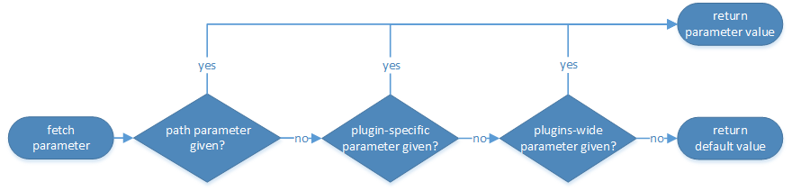

<!-- loioe2d3e543067e4f3282bf6dbf880c6b2d -->

# SAP HDI Parameters

An overview of the parameters available for the SAP HANA Deployment Infrastructure \(HDI\) and the corresponding build plug-ins.


In SAP HANA Deployment Infrastructure \(HDI\), parameters are a means of controlling the execution flow of SAP HDI procedure calls. SAP HDI includes the following parameter types:

-   [SAP HDI parameters](sap-hdi-parameters-e2d3e54.md#loioe2d3e543067e4f3282bf6dbf880c6b2d__section_kdd_3n3_jpb)

    SAP HDI parameters are used to control the execution flow of SAP HDI procedures, procedures specific to SAP HDI container groups, and procedures specific to SAP HDI containers. For example, the parameters can specify the time a container operation waits for a locking conflict to clear or indicate if warnings during an SAP HDI call should be treated as errors.

-   [Build plug-in parameters](sap-hdi-parameters-e2d3e54.md#loioe2d3e543067e4f3282bf6dbf880c6b2d__section_or5_3n3_jpb)

    Build plug-in parameters control the execution flow of the deployment process of a build plug-in for all database objects of the corresponding type. For example, a parameter for a build plug-in can be used to specify the batch size for batch access to the database or for batch processing within a build plug-in.


## SAP HDI Procedures

The information in this section lists and describes the procedures available for the configuration of SAP HDI, HDI containers, and HDI container groups along with the parameters available to configure the procedures:

-   [SAP HDI Procedures](sap-hdi-parameters-e2d3e54.md#loioe2d3e543067e4f3282bf6dbf880c6b2d__table_dzb_ff3_rv)
-   [SAP HDI Container-specific Procedures](sap-hdi-parameters-e2d3e54.md#loioe2d3e543067e4f3282bf6dbf880c6b2d__table_mky_kgb_xkb)
-   [SAP HDI Container Procedures](sap-hdi-parameters-e2d3e54.md#loioe2d3e543067e4f3282bf6dbf880c6b2d__table_ist_r33_rv)

The following table lists the parameters available for use with SAP HDI `_SYS_DI` procedures.


<table>
<tr>
<th valign="top">

SAP HDI Call

</th>
<th valign="top">

Available Parameters

</th>
</tr>
<tr>
<td valign="top">

`_SYS_DI.CREATE_CONTAINER_GROUP` 

</td>
<td valign="top">

trace\_context

trace\_level.*<trace topic\>*

message\_severity

</td>
</tr>
<tr>
<td valign="top">

`_SYS_DI.DROP_CONTAINER_GROUP` 

</td>
<td valign="top">

trace\_context

trace\_level.*<trace topic\>*

message\_severity

</td>
</tr>
<tr>
<td valign="top">

`_SYS_DI.GRANT_CONTAINER_GROUP_API_PRIVILEGES` 

</td>
<td valign="top">

trace\_context

trace\_level.*<trace topic\>*

message\_severity

</td>
</tr>
<tr>
<td valign="top">

`_SYS_DI.GRANT_CONTAINER_GROUP_API_PRIVILEGES_WITH_ GRANT_OPTION` 

</td>
<td valign="top">

trace\_context

trace\_level.*<trace topic\>*

message\_severity

</td>
</tr>
<tr>
<td valign="top">

`_SYS_DI.GRANT_DI_SUPPORT_PRIVILEGE` 

</td>
<td valign="top">

trace\_context

trace\_level.*<trace topic\>*

message\_severity

</td>
</tr>
<tr>
<td valign="top">

`_SYS_DI.LIST_LIBRARIES` 

</td>
<td valign="top">

trace\_context

trace\_level.*<trace topic\>*

message\_severity

</td>
</tr>
<tr>
<td valign="top">

`_SYS_DI.MOVE_CONTAINER_TO_GROUP` 

</td>
<td valign="top">

trace\_context

trace\_level.*<trace topic\>*

message\_severity

</td>
</tr>
<tr>
<td valign="top">

`_SYS_DI.REVOKE_CONTAINER_GROUP_API_PRIVILEGES` 

</td>
<td valign="top">

trace\_context

trace\_level.*<trace topic\>*

message\_severity

</td>
</tr>
<tr>
<td valign="top">

`_SYS_DI.REVOKE_DI_SUPPORT_PRIVILEGE` 

</td>
<td valign="top">

trace\_context

trace\_level.*<trace topic\>*

message\_severity

</td>
</tr>
</table>


### Example: Calling an SAP HDI Procedure with Parameters Set

> ### Sample Code:  
> ```sql
> -- prepare parameters table
> create table MY_PARAMETERS like _SYS_DI.TT_PARAMETERS;
> insert into MY_PARAMETERS (KEY, VALUE) values ('message_severity', 'WARNING');
> 
> -- call procedure
> call _SYS_DI.CREATE_CONTAINER_GROUP ('MY_CONTAINER_GROUP', MY_PARAMETERS, ?, ?, ?);
> 
> ```


<a name="loioe2d3e543067e4f3282bf6dbf880c6b2d__section_d3x_fgb_xkb"/>

## SAP HDI Container-Group-Specific Procedures

The following table lists the parameters available for use with SAP HDI container-group-specific procedures.


<table>
<tr>
<th valign="top">

SAP HDI Call

</th>
<th valign="top">

Available Parameters

</th>
</tr>
<tr>
<td valign="top">

<code>_SYS_DI#<i class="varname">&lt;container_group&gt;</i>.CANCEL</code> 

</td>
<td valign="top">

container\_lock\_wait\_timeout

trace\_context

trace\_level.*<trace topic\>*

treat\_warnings\_as\_errors

message\_severity

</td>
</tr>
<tr>
<td valign="top">

<code>_SYS_DI#<i class="varname">&lt;container_group&gt;</i>.CONFIGURE_CONTAINER_PARAMETERS</code> 

</td>
<td valign="top">

container\_lock\_wait\_timeout

trace\_context

trace\_level.*<trace topic\>*

message\_severity

</td>
</tr>
<tr>
<td valign="top">

<code>_SYS_DI#<i class="varname">&lt;container_group&gt;</i>.CONFIGURE_LIBRARIES</code> 

</td>
<td valign="top">

container\_lock\_wait\_timeout

trace\_context

trace\_level.*<trace topic\>*

undeploy

message\_severity

</td>
</tr>
<tr>
<td valign="top">

<code>_SYS_DI#<i class="varname">&lt;container_group&gt;</i>.CREATE_CONTAINER</code> 

</td>
<td valign="top">

trace\_context

trace\_level.*<trace topic\>*

message\_severity

</td>
</tr>
<tr>
<td valign="top">

<code>_SYS_DI#<i class="varname">&lt;container_group&gt;</i>.DROP_CONTAINER</code> 

</td>
<td valign="top">

container\_lock\_wait\_timeout

drop\_container\_asynchronously

ignore\_deployed

ignore\_errors

ignore\_work

enable\_drop\_enforcer

trace\_context

trace\_level.*<trace topic\>*

message\_severity

</td>
</tr>
<tr>
<td valign="top">

<code>_SYS_DI#<i class="varname">&lt;container_group&gt;</i>.EXPORT_CONTAINER_FOR_COPY</code> 

</td>
<td valign="top">

container\_lock\_wait\_timeout

export\_container\_schema\_data

export\_container\_use\_binary\_export

trace\_context

trace\_level.*<trace topic\>*

message\_severity

</td>
</tr>
<tr>
<td valign="top">

<code>_SYS_DI#<i class="varname">&lt;container_group&gt;</i>.EXPORT_CONTAINER_FOR_SUPPORT</code> 

</td>
<td valign="top">

container\_lock\_wait\_timeout

export\_container\_schema\_data

export\_container\_use\_binary\_export

export\_container\_schema\_foreign\_objects

trace\_context

trace\_level.*<trace topic\>*

message\_severity

</td>
</tr>
<tr>
<td valign="top">

<code>_SYS_DI#<i class="varname">&lt;container_group&gt;</i>.GRANT_CONTAINER_API_PRIVILEGES</code> 

</td>
<td valign="top">

container\_lock\_wait\_timeout

trace\_context

trace\_level.*<trace topic\>*

message\_severity

</td>
</tr>
<tr>
<td valign="top">

<code>_SYS_DI#<i class="varname">&lt;container_group&gt;</i>.GRANT_CONTAINER_API_PRIVILEGES_WITH_GRANT_OPTION</code> 

</td>
<td valign="top">

container\_lock\_wait\_timeout

trace\_context

trace\_level.<trace topic\>

message\_severity

</td>
</tr>
<tr>
<td valign="top">

<code>_SYS_DI#<i class="varname">&lt;container_group&gt;</i>.GRANT_CONTAINER_GROUP_API_PRIVILEGES</code> 

</td>
<td valign="top">

trace\_context

trace\_level.*<trace topic\>*

message\_severity

</td>
</tr>
<tr>
<td valign="top">

<code>_SYS_DI#<i class="varname">&lt;container_group&gt;</i>.GRANT_CONTAINER_GROUP_API_PRIVILEGES_WITH_ GRANT_OPTION</code> 

</td>
<td valign="top">

trace\_context

trace\_level.*<trace topic\>*

message\_severity

</td>
</tr>
<tr>
<td valign="top">

<code>_SYS_DI#<i class="varname">&lt;container_group&gt;</i>.GRANT_CONTAINER_SCHEMA_PRIVILEGES</code> 

</td>
<td valign="top">

container\_lock\_wait\_timeout

trace\_context

trace\_level.*<trace topic\>*

message\_severity

</td>
</tr>
<tr>
<td valign="top">

<code>_SYS_DI#<i class="varname">&lt;container_group&gt;</i>.GRANT_CONTAINER_SCHEMA_ROLES</code> 

</td>
<td valign="top">

container\_lock\_wait\_timeout

trace\_context

trace\_level.*<trace topic\>* 

message\_severity

</td>
</tr>
<tr>
<td valign="top">

<code>_SYS_DI#<i class="varname">&lt;container_group&gt;</i>.GRANT_CONTAINER_SUPPORT_PRIVILEGE</code> 

</td>
<td valign="top">

container\_lock\_wait\_timeout

trace\_context

trace\_level.*<trace topic\>*

message\_severity

</td>
</tr>
<tr>
<td valign="top">

<code>_SYS_DI#<i class="varname">&lt;container_group&gt;</i>.IMPORT_CONTAINER_FOR_COPY</code> 

</td>
<td valign="top">

trace\_level.*<trace topic\>*

message\_severity

</td>
</tr>
<tr>
<td valign="top">

<code>_SYS_DI#<i class="varname">&lt;container_group&gt;</i>.IMPORT_CONTAINER_FOR_SUPPORT</code> 

</td>
<td valign="top">

container\_lock\_wait\_timeout

accept\_risk\_of\_database\_corruption\_by\_container\_import

trace\_context

trace\_level.*<trace topic\>*

message\_severity

</td>
</tr>
<tr>
<td valign="top">

<code>_SYS_DI#<i class="varname">&lt;container_group&gt;</i>.LIST_CONFIGURED_LIBRARIES</code> 

</td>
<td valign="top">

container\_lock\_wait\_timeout

trace\_context

trace\_level.*<trace topic\>*

message\_severity

</td>
</tr>
<tr>
<td valign="top">

<code>_SYS_DI#<i class="varname">&lt;container_group&gt;</i>.REVOKE_CONTAINER_API_PRIVILEGES</code> 

</td>
<td valign="top">

container\_lock\_wait\_timeout

trace\_context

trace\_level.*<trace topic\>*

message\_severity

</td>
</tr>
<tr>
<td valign="top">

<code>_SYS_DI#<i class="varname">&lt;container_group&gt;</i>.REVOKE_CONTAINER_GROUP_API_PRIVILEGES</code> 

</td>
<td valign="top">

trace\_context

trace\_level.*<trace topic\>*

message\_severity

</td>
</tr>
<tr>
<td valign="top">

<code>_SYS_DI#<i class="varname">&lt;container_group&gt;</i>.REVOKE_CONTAINER_SCHEMA_PRIVILEGES</code> 

</td>
<td valign="top">

container\_lock\_wait\_timeout

trace\_context

trace\_level.*<trace topic\>*

message\_severity

</td>
</tr>
<tr>
<td valign="top">

<code>_SYS_DI#<i class="varname">&lt;container_group&gt;</i>.REVOKE_CONTAINER_SCHEMA_ROLES</code> 

</td>
<td valign="top">

container\_lock\_wait\_timeout

trace\_context

trace\_level.*<trace topic\>*

message\_severity

</td>
</tr>
<tr>
<td valign="top">

<code>_SYS_DI#<i class="varname">&lt;container_group&gt;</i>.REVOKE_CONTAINER_SUPPORT_PRIVILEGE</code> 

</td>
<td valign="top">

container\_lock\_wait\_timeout

trace\_context

trace\_level.*<trace topic\>*

message\_severity

</td>
</tr>
</table>


### Example: Calling an SAP HDI Procedure with Parameters Set

> ### Sample Code:  
> ```sql
> -- prepare parameters table
> create table MY_PARAMETERS like _SYS_DI.TT_PARAMETERS;
> insert into MY_PARAMETERS (KEY, VALUE) values ('ignore_work', 'true');
> insert into MY_PARAMETERS (KEY, VALUE) values ('ignore_deployed', 'true'); 
> 
> -- call procedure
> call _SYS_DI#<container_group_name>.DROP_CONTAINER('MY_CONTAINER', MY_PARAMETERS, ?, ?, ?);
> ```


## SAP HDI Container-Specific Procedures

The following table lists the parameters available for use with SAP HDI container-specific procedures.


<table>
<tr>
<th valign="top">

SAP HDI Container-Specific Call

</th>
<th valign="top">

Available Parameters

</th>
</tr>
<tr>
<td valign="top">

<code><i class="varname">&lt;container&gt;</i>#DI.CANCEL</code> 

</td>
<td valign="top">

container\_lock\_wait\_timeout

trace\_context

trace\_level.*<trace topic\>*

treat\_warnings\_as\_errors

message\_severity

</td>
</tr>
<tr>
<td valign="top">

<code><i class="varname">&lt;container&gt;</i>#DI.CONFIGURE_CONTAINER_PARAMETERS</code> 

</td>
<td valign="top">

container\_lock\_wait\_timeout

trace\_context

trace\_level.*<trace topic\>*

message\_severity

</td>
</tr>
<tr>
<td valign="top">

<code><i class="varname">&lt;container&gt;</i>#DI.CONFIGURE_LIBRARIES</code> 

</td>
<td valign="top">

container\_lock\_wait\_timeout

trace\_context

trace\_level.*<trace topic\>*

undeploy

message\_severity

</td>
</tr>
<tr>
<td valign="top">

<code><i class="varname">&lt;container&gt;</i>#DI.DELETE</code> 

</td>
<td valign="top">

container\_lock\_wait\_timeout

ignore\_non\_existing\_paths

recursive

trace\_context

trace\_level.*<trace topic\>*

message\_severity

</td>
</tr>
<tr>
<td valign="top">

<code><i class="varname">&lt;container&gt;</i>#DI.EXPORT_CONTAINER_FOR_COPY</code> 

</td>
<td valign="top">

container\_lock\_wait\_timeout

export\_container\_schema\_data

export\_container\_use\_binary\_export

trace\_context

trace\_level.*<trace topic\>*

message\_severity

</td>
</tr>
<tr>
<td valign="top">

<code><i class="varname">&lt;container&gt;</i>#DI.GET_DEPENDENCIES</code> 

</td>
<td valign="top">

container\_lock\_wait\_timeout

trace\_context

trace\_level.*<trace topic\>*

variant

message\_severity

</td>
</tr>
<tr>
<td valign="top">

<code><i class="varname">&lt;container&gt;</i>#DI.GET_MAKE_GROUPS</code> 

</td>
<td valign="top">

container\_lock\_wait\_timeout

max\_parallel\_jobs

optimized\_redeploy

simulate\_make

skip\_unchanged\_expansions

trace\_context

trace\_level.*<trace topic\>*

treat\_warnings\_as\_errors

undeploy\_dependent\_recursively

message\_severity

</td>
</tr>
<tr>
<td valign="top">

<code><i class="varname">&lt;container&gt;</i>#DI.GRANT_CONTAINER_API_PRIVILEGES</code> 

</td>
<td valign="top">

container\_lock\_wait\_timeout

trace\_context

trace\_level.*<trace topic\>*

message\_severity

</td>
</tr>
<tr>
<td valign="top">

<code><i class="varname">&lt;container&gt;</i>#DI.GRANT_CONTAINER_API_PRIVILEGES_WITH_GRANT_OPTION</code> 

</td>
<td valign="top">

container\_lock\_wait\_timeout

trace\_context

trace\_level.*<trace topic\>*

message\_severity

</td>
</tr>
<tr>
<td valign="top">

<code><i class="varname">&lt;container&gt;</i>#DI.GRANT_CONTAINER_SCHEMA_PRIVILEGES</code> 

</td>
<td valign="top">

container\_lock\_wait\_timeout

trace\_context

trace\_level.*<trace topic\>*

message\_severity

</td>
</tr>
<tr>
<td valign="top">

<code><i class="varname">&lt;container&gt;</i>#DI.GRANT_CONTAINER_SCHEMA_ROLES</code> 

</td>
<td valign="top">

container\_lock\_wait\_timeout

trace\_context

trace\_level.*<trace topic\>*

message\_severity

</td>
</tr>
<tr>
<td valign="top">

<code><i class="varname">&lt;container&gt;</i>#DI.IMPORT_CONTAINER_FOR_COPY</code> 

</td>
<td valign="top">

container\_lock\_wait\_timeout

trace\_context

trace\_level.*<trace topic\>*

message\_severity

</td>
</tr>
<tr>
<td valign="top">

<code><i class="varname">&lt;container&gt;</i>#DI.LIST</code> 

</td>
<td valign="top">

container\_lock\_wait\_timeout

ignore\_files

ignore\_folders

recursive

trace\_context

trace\_level.*<trace topic\>*

message\_severity

</td>
</tr>
<tr>
<td valign="top">

<code><i class="varname">&lt;container&gt;</i>#DI.LIST_CONFIGURED_LIBRARIES</code> 

</td>
<td valign="top">

container\_lock\_wait\_timeout

trace\_context

trace\_level.*<trace topic\>*

message\_severity

</td>
</tr>
<tr>
<td valign="top">

<code><i class="varname">&lt;container&gt;</i>#DI.LIST_DEPLOYED</code> 

</td>
<td valign="top">

container\_lock\_wait\_timeout

ignore\_files

ignore\_folders

recursive

trace\_context

trace\_level.*<trace topic\>*

message\_severity

</td>
</tr>
<tr>
<td valign="top">

<code><i class="varname">&lt;container&gt;</i>#DI.MAKE</code> 

</td>
<td valign="top">

container\_lock\_wait\_timeout

max\_parallel\_jobs

optimized\_redeploy

simulate\_make

skip\_unchanged\_expansions

stop\_on\_error

trace\_context

trace\_level.*<trace topic\>*

treat\_warnings\_as\_errors

undeploy\_dependent\_recursively

validate\_external\_dependencies

enable\_make\_enforcer

message\_severity

</td>
</tr>
<tr>
<td valign="top">

<code><i class="varname">&lt;container&gt;</i>#DI.MAKE_ASYNC</code> 

</td>
<td valign="top">

container\_lock\_wait\_timeout

max\_parallel\_jobs

optimized\_redeploy

simulate\_make

skip\_unchanged\_expansions

stop\_on\_error

trace\_context

trace\_level.*<trace topic\>*

treat\_warnings\_as\_errors

undeploy\_dependent\_recursively

validate\_external\_dependencies

enable\_make\_enforcer

message\_severity

</td>
</tr>
<tr>
<td valign="top">

<code><i class="varname">&lt;container&gt;</i>#DI.READ</code> 

</td>
<td valign="top">

container\_lock\_wait\_timeout

ignore\_files

ignore\_folders

recursive

trace\_context

trace\_level.*<trace topic\>*

message\_severity

</td>
</tr>
<tr>
<td valign="top">

<code><i class="varname">&lt;container&gt;</i>#DI.READ_DEPLOYED</code> 

</td>
<td valign="top">

container\_lock\_wait\_timeout

ignore\_files

ignore\_folders

recursive

trace\_context

trace\_level.*<trace topic\>*

message\_severity

</td>
</tr>
<tr>
<td valign="top">

<code><i class="varname">&lt;container&gt;</i>#DI.REVOKE_CONTAINER_API_PRIVILEGES</code> 

</td>
<td valign="top">

container\_lock\_wait\_timeout

trace\_context

trace\_level.*<trace topic\>*

message\_severity

</td>
</tr>
<tr>
<td valign="top">

<code><i class="varname">&lt;container&gt;</i>#DI.REVOKE_CONTAINER_SCHEMA_PRIVILEGES</code> 

</td>
<td valign="top">

container\_lock\_wait\_timeout

trace\_context

trace\_level.*<trace topic\>*

message\_severity

</td>
</tr>
<tr>
<td valign="top">

<code><i class="varname">&lt;container&gt;</i>#DI.REVOKE_CONTAINER_SCHEMA_ROLES</code> 

</td>
<td valign="top">

container\_lock\_wait\_timeout

trace\_context

trace\_level.*<trace topic\>*

message\_severity

</td>
</tr>
<tr>
<td valign="top">

<code><i class="varname">&lt;container&gt;</i>#DI.STATUS</code> 

</td>
<td valign="top">

container\_lock\_wait\_timeout

trace\_context

trace\_level.*<trace topic\>*

message\_severity

</td>
</tr>
<tr>
<td valign="top">

<code><i class="varname">&lt;container&gt;</i>#DI.WRITE</code> 

</td>
<td valign="top">

container\_lock\_wait\_timeout

trace\_context

trace\_level.*<trace topic\>*

message\_severity

</td>
</tr>
<tr>
<td valign="top">

<code><i class="varname">&lt;container&gt;</i>#DI.CONFIGURE_CONTAINER</code> 

</td>
<td valign="top">

> ### Caution:  
> Deprecated since SAP HANA 1.0 SPS 12.


</td>
</tr>
</table>


### Example: Calling a Container-Specific Procedure with Parameters Set

> ### Sample Code:  
> ```sql
> -- prepare path content table
> create table MY_PATH_CONTENT like _SYS_DI.TT_FILESFOLDERS_CONTENT;
> insert into MY_PATH_CONTENT (PATH, CONTENT) values ('mypath/', '');
> insert into MY_PATH_CONTENT (PATH, CONTENT) values ('mypath/myfile1.hdbtable', 'ROW TABLE MY_TABLE (X INTEGER)');
> insert into MY_PATH_CONTENT (PATH, CONTENT) values ('mypath/.hdiconfig', '{
> "file_suffixes" : { "hdbtable" : { "plugin_name" : "com.sap.hana.di.table", 
> "plugin_version" : "12.0.0" } } }');
>  
> 
> -- prepare parameters table
> create table MY_PARAMETERS like _SYS_DI.TT_PARAMETERS;
> insert into MY_PARAMETERS (KEY, VALUE) values ('container_lock_wait_timeout', '10');
> 
> 
> -- call procedure
> call <container name>#DI.WRITE(MY_PATH_CONTENT, MY_PARAMETERS, ?, ?, ?);
> 
> ```


<a name="loioe2d3e543067e4f3282bf6dbf880c6b2d__section_kdd_3n3_jpb"/>

## Available SAP HDI Parameters

The following table describes the parameters available in SAP HDI and their possible values.


<table>
<tr>
<th valign="top">

Parameter

</th>
<th valign="top">

Possible values

</th>
<th valign="top">

Description

</th>
</tr>
<tr>
<td valign="top">

`container_lock_wait_timeout` 

</td>
<td valign="top">

0 … 2,147,483,647

</td>
<td valign="top">

Specifies the time \(in milliseconds\) a container operation waits for a locking conflict to clear. The default value is the value of the corresponding SAP HDI configuration parameter `connection.container_default_transaction_lock_wait_timeout`.

For more information, see *SAP HDI Configuration Parameters*.

</td>
</tr>
<tr>
<td valign="top">

`accept_risk_of_database_ corruption_by_container_import` 

</td>
<td valign="top">

true, false

</td>
<td valign="top">

Indicates that the user knows that a container import could potentially corrupt the database.

The default value is “false”.

</td>
</tr>
<tr>
<td valign="top">

`drop_container_asynchronously` 

</td>
<td valign="top">

true, false

</td>
<td valign="top">

Indicates that the drop-container operation should run asynchronously.

The default value is “false”.

</td>
</tr>
<tr>
<td valign="top">

`enable_drop_enforcer` 

</td>
<td valign="top">

true, false

</td>
<td valign="top">

If “true”, terminate all external database connections blocking a make call and, in addition, all external database connections holding data in a global temporary table in the container schema.

The default value is “true”.

</td>
</tr>
<tr>
<td valign="top">

`enable_make_enforcer` 

</td>
<td valign="top">

true, false

</td>
<td valign="top">

If “true”, terminate all external database connections blocking a make call.

The default value is “true”.

</td>
</tr>
<tr>
<td valign="top">

`export_container_schema_data` 

</td>
<td valign="top">

true, false

</td>
<td valign="top">

Indicates that a container export should also export the data of the container schema. If set to “false”, only the schema structure will be exported.

The default value is “true”.

</td>
</tr>
<tr>
<td valign="top">

`export_container_use_binary_export` 

</td>
<td valign="top">

true, false

</td>
<td valign="top">

Indicates that the container export should export data in a binary format. If set to “false”, the data is exported as CSV.

The default value is “true”

</td>
</tr>
<tr>
<td valign="top">

`ignore_deployed` 

</td>
<td valign="top">

true, false

</td>
<td valign="top">

Indicates if existing files in the deployed file system are to be ignored when dropping a container.

The default value is “false”.

</td>
</tr>
<tr>
<td valign="top">

`ignore_errors` 

</td>
<td valign="top">

true, false

</td>
<td valign="top">

Indicates if errors during an SAP HDI call should be ignored, that is, execute and commit as many internal operations as possible. Failing operations are reported to the user.

The default value is “false”.

</td>
</tr>
<tr>
<td valign="top">

`ignore_files` 

</td>
<td valign="top">

true, false

</td>
<td valign="top">

Indicates if files are to be ignored in the output when reading files.

The default value is “false”.

</td>
</tr>
<tr>
<td valign="top">

`ignore_folders` 

</td>
<td valign="top">

true, false

</td>
<td valign="top">

Indicates if folders are to be ignored in the output when reading files.

The default value is “false”.

</td>
</tr>
<tr>
<td valign="top">

`ignore_non_existing_paths` 

</td>
<td valign="top">

true, false

</td>
<td valign="top">

Indicates if paths that do not exist should be ignored, for example, when deleting folders.

The default value is “false”.

</td>
</tr>
<tr>
<td valign="top">

`ignore_work` 

</td>
<td valign="top">

true, false

</td>
<td valign="top">

Indicates if existing files in the work file system are to be ignored when dropping a container.

The default value is “false”.

</td>
</tr>
<tr>
<td valign="top">

`max_parallel_jobs` 

</td>
<td valign="top">

0 … 2,147,483,647

</td>
<td valign="top">

Specifies the maximum number of parallel jobs for graph execution and artifact deployment.

The default value is 8.

</td>
</tr>
<tr>
<td valign="top">

`move_containers_to_default_group` 

</td>
<td valign="top">

true, false

</td>
<td valign="top">

Indicates if all containers in a group should be moved to the default group \_SYS\_DI first before dropping the container group.

The default value is “false”.

</td>
</tr>
<tr>
<td valign="top">

`optimized_redeploy` 

</td>
<td valign="top">

true, false

</td>
<td valign="top">

Indicates if the optimized redeployment strategy should be used instead of the undeploy-deploy mechanism when redeploying artifacts.

The default value is “true”.

</td>
</tr>
<tr>
<td valign="top">

`recursive` 

</td>
<td valign="top">

true, false

</td>
<td valign="top">

Indicates if folders are to be read or deleted recursively.

The default value is “false”.

</td>
</tr>
<tr>
<td valign="top">

`simulate_make` 

</td>
<td valign="top">

true, false

</td>
<td valign="top">

Indicates if the make command should run only in simulation mode.

The default value is “false”.

</td>
</tr>
<tr>
<td valign="top">

`stop_on_error` 

</td>
<td valign="top">

true, false

</td>
<td valign="top">

Indicates if the `make` command should stop deploying further files if an error occurs while deploying a file.

> ### Note:  
> The HDI deployer does not stop at the first error it encounters. If multiple artifacts are being deployed in parallel and there are multiple errors, then the HDI deployer displays multiple error messages and tries to stop as soon as it can.

The default value is “true”.

</td>
</tr>
<tr>
<td valign="top">

`trace_context` 

</td>
<td valign="top">

request, container

</td>
<td valign="top">

Indicates if, during an SAP HDI request, all traces for trace topics configured using the `trace_level_<trace topic>` parameter are written to a separate trace file in addition to the DI server trace file. If set to “request”, a new trace file is created for the request. For container operations, if set to “container”, a trace file for the corresponding container is created or appended to.

There is no default value.

</td>
</tr>
<tr>
<td valign="top">

`trace_level.<trace topic>` 

</td>
<td valign="top">

Fatal, Error, Warning, Info, Interface, Debug, InterfaceFull, DebugFull

</td>
<td valign="top">

Specifies the trace level of a specific trace topic. *<trace topic\>* may be an arbitrary SAP HANA trace topic.

There is no default value.

</td>
</tr>
<tr>
<td valign="top">

`treat_warnings_as_errors` 

</td>
<td valign="top">

true, false

</td>
<td valign="top">

Indicates if warnings during an SAP HDI call should be treated as errors.

The default value is “false”.

</td>
</tr>
<tr>
<td valign="top">

`undeploy` 

</td>
<td valign="top">

true, false

</td>
<td valign="top">

Indicates if, in case of a call to configure libraries, files corresponding to a library to be removed should also be undeployed.

The default value is “false”.

</td>
</tr>
<tr>
<td valign="top">

`undeploy_dependent_recursively` 

</td>
<td valign="top">

true, false

</td>
<td valign="top">

Indicates that all dependent artifacts should be considered for an undeployment.

The default value is “false”.

</td>
</tr>
<tr>
<td valign="top">

`validate_external_dependencies` 

</td>
<td valign="top">

true, false

</td>
<td valign="top">

Indicates that during a make, all deployed synonyms, projection views, and virtual tables should be checked for changes to referenced objects and redeployed, if a change is detected.

The default value is “false”.

</td>
</tr>
<tr>
<td valign="top">

`variant` 

</td>
<td valign="top">

“providers”, “provides\_and\_requires”, “impacted”, “depends” 

</td>
<td valign="top">

Specifies the variant of the SAP HDI \(HDI\) container-specific procedure <code><i class="varname">&lt;container&gt;</i>#DI.GET_DEPENDENCIES</code> to be used; the following values are permitted:

-   “`providers`”

    Returns the providing file for a given database object

-   “`provides_and_requires`”

    Returns the provided and required database objects for a given artifact

-   “`impacted`”

    Returns the files that depend on \(are affected by\) the specified files.

-   “`depends`”

    Returns the files that the specified files depend on.


The default value is “providers”.

</td>
</tr>
<tr>
<td valign="top">

`message_severity` 

</td>
<td valign="top">

INFO, WARNING, ERROR

</td>
<td valign="top">

Specifies the minimum severity of the messages to be returned by a SAP HDI procedure call.

The default value is INFO \(all messages are returned\).

</td>
</tr>
</table>


<a name="loioe2d3e543067e4f3282bf6dbf880c6b2d__section_or5_3n3_jpb"/>

## Parameters for Build Plugins

SAP HDI supports three types of parameters for controlling the execution flow of build plug-ins. On a global level, a “plug-ins-wide parameter” applies to all build plug-ins supporting the parameter. On a more fine-grained level, a “plug-in-specific parameter” only applies to the specified build plug-in. Eventually, a “path parameter” serves to control the handling of a single file.

The following table describes the structure of each parameter type.


<table>
<tr>
<th valign="top">

Parameter Type

</th>
<th valign="top">

File

</th>
<th valign="top">

Parameter Structure

</th>
</tr>
<tr>
<td valign="top">

plug-ins-wide parameter

</td>
<td valign="top">

\-

</td>
<td valign="top">

com.sap.hana.di/<key\>

</td>
</tr>
<tr>
<td valign="top">

plug-in-specific parameter

</td>
<td valign="top">

\-

</td>
<td valign="top">

com.sap.hana.di.<plug-in\>/<key\>

</td>
</tr>
<tr>
<td valign="top">

path parameter

</td>
<td valign="top">

<file\>

</td>
<td valign="top">

<key\>

</td>
</tr>
</table>

From the point of view of a build plug-in, the three types of parameters form a hierarchy whereby the most specific parameter type is considered first. The following diagram visualizes the process of fetching a parameter from the point of view of a build plug-in.



The plug-in-specific parameters support additional layering by allowing additional layers within the parameter structure. For example, if a requested parameter `com.sap.hana.di.<layer1>.<plug-in1>/<key>` is not found, the build plug-in automatically searches for a parameter `com.sap.hana.di.<layer1>/<key>`. The following table shows an example of layering of parameters.


<table>
<tr>
<th valign="top">

Parameter Type

</th>
<th valign="top">

File

</th>
<th valign="top">

Parameter Structure

</th>
</tr>
<tr>
<td valign="top">

plug-ins-wide parameter

</td>
<td valign="top">

\-

</td>
<td valign="top">

com.sap.hana.di/*<key\>* 

</td>
</tr>
<tr>
<td valign="top">

layered parameter

</td>
<td valign="top">

\-

</td>
<td valign="top">

com.sap.hana.di.*<layer1\>*/*<key\>* 

</td>
</tr>
<tr>
<td valign="top">

layered plug-in parameter

</td>
<td valign="top">

\-

</td>
<td valign="top">

com.sap.hana.di.*<layer1\>*.*<plug-in1\>*/*<key\>* 

</td>
</tr>
<tr>
<td valign="top">

path parameter

</td>
<td valign="top">

<file\>

</td>
<td valign="top">

*<key\>* 

</td>
</tr>
</table>

The following section lists the available build plug-in parameters and path parameters in SAP HDI. The section *Build Plugin Parameters* describes the available parameters for the configuration of uild plug-ins.


<a name="loioe2d3e543067e4f3282bf6dbf880c6b2d__section_egn_jn3_jpb"/>

## Build Plug-ins

The following table lists the available parameters for the build plug-ins.


<table>
<tr>
<th valign="top">

Build Plug-in

</th>
<th valign="top">

Available Build Plug-in Parameters

</th>
<th valign="top">

Available Path Parameters

</th>
</tr>
<tr>
<td valign="top">

Applies to all build plug-ins

</td>
<td valign="top">

`optimized_redeploy`

`skip_unchanged_expansions`

`undeploy_dependent_recursively`

</td>
<td valign="top">

\-

</td>
</tr>
<tr>
<td valign="top">

com.sap.hana.di.role

</td>
<td valign="top">

`force_undeploy`

`revoke_external_grants`

</td>
<td valign="top">

\-

\-

</td>
</tr>
<tr>
<td valign="top">

com.sap.hana.di.sequence

</td>
<td valign="top">

`force_undeploy` 

</td>
<td valign="top">

\-

</td>
</tr>
<tr>
<td valign="top">

com.sap.hana.di.table

</td>
<td valign="top">

`force_undeploy`

`try_fast_table_migration`

`force_drop_columns`

</td>
<td valign="top">

\-

</td>
</tr>
<tr>
<td valign="top">

com.sap.hana.di.tabledata

</td>
<td valign="top">

`batch_size` 

</td>
<td valign="top">

\-

</td>
</tr>
<tr>
<td valign="top">

com.sap.hana.di.table.migration

</td>
<td valign="top">

`development_mode` 

</td>
<td valign="top">

\-

</td>
</tr>
</table>

Example for calling the make procedure with a plug-ins-wide parameter set:

> ### Sample Code:  
> ```sql
> -- prepare deploy paths table
> create table MY_DEPLOY_PATHS like _SYS_DI.TT_FILESFOLDERS;
> insert into MY_DEPLOY_PATHS (PATH) values ('mypath/myfile1.hdbtable');
> insert into MY_DEPLOY_PATHS (PATH) values ('mypath/.hdiconfig');
> 
> -- prepare parameters table with a plug-ins-wide parameter
> create table MY_PARAMETERS like _SYS_DI.TT_PARAMETERS;
> insert into MY_PARAMETERS (KEY, VALUE) values ('com.sap.hana.di/force_undeploy', 'true');
> 
> -- call procedure
> call <container name>#DI.MAKE(MY_DEPLOY_PATHS, _SYS_DI.T_NO_FILESFOLDERS, _SYS_DI.T_NO_FILESFOLDERS_PARAMETERS, MY_PARAMETERS, ?, ?, ?);
> 
> ```

Example for calling the make procedure with a plug-in-specific parameter set:

> ### Sample Code:  
> ```sql
> -- prepare deploy paths table
> create table MY_DEPLOY_PATHS like _SYS_DI.TT_FILESFOLDERS;
> insert into MY_DEPLOY_PATHS (PATH) values ('mypath/myfile1.hdbtable');
> insert into MY_DEPLOY_PATHS (PATH) values ('mypath/.hdiconfig');
> 
> -- prepare parameters table with a plug-in-specific parameter
> create table MY_PARAMETERS like _SYS_DI.TT_PARAMETERS;
> insert into MY_PARAMETERS (KEY, VALUE) values ('com.sap.hana.di.table/force_undeploy', 'true');
> 
> -- call procedure
> call <container name>#DI.MAKE(MY_DEPLOY_PATHS, _SYS_DI.T_NO_FILESFOLDERS, _SYS_DI.T_NO_FILESFOLDERS_PARAMETERS, MY_PARAMETERS, ?, ?, ?);
> 
> ```

Example for calling the make procedure with a path parameter set:

> ### Sample Code:  
> ```sql
> -- prepare deploy paths table
> create table MY_DEPLOY_PATHS like _SYS_DI.TT_FILESFOLDERS;
> insert into MY_DEPLOY_PATHS (PATH) values ('mypath/myfile1.hdbtable');
> insert into MY_DEPLOY_PATHS (PATH) values ('mypath/.hdiconfig');
> 
> -- prepare path parameters table
> create table MY_PATH_PARAMETERS like _SYS_DI.TT_FILESFOLDERS_PARAMETERS;
> insert into MY_PATH_PARAMETERS (PATH, KEY, VALUE) values ('mypath/myfile1.hdbtable', 'force_undeploy', 'true');
> 
> -- call procedure
> call <container name>#DI.MAKE(MY_DEPLOY_PATHS, _SYS_DI.T_NO_FILESFOLDERS, MY_PATH_PARAMETERS, _SYS_DI.T_NO_PARAMETERS, ?, ?, ?);
> 
> ```


<a name="loioe2d3e543067e4f3282bf6dbf880c6b2d__section_inz_jn3_jpb"/>

## Build Plug-in Parameters

The following table describes the build plug-in parameters available in SAP HDI and their possible values.


<table>
<tr>
<th valign="top">

Build Plug-in Parameter

</th>
<th valign="top">

Possible Values

</th>
<th valign="top">

Description

</th>
</tr>
<tr>
<td valign="top">

`batch_size` 

</td>
<td valign="top">

0 … 2,147,483,647

</td>
<td valign="top">

Specifies the batch size, for example, for batch database access or for batch processing within a build plug-in.

The default value is “4000”.

</td>
</tr>
<tr>
<td valign="top">

`development_mode` 

</td>
<td valign="top">

true, false

</td>
<td valign="top">

Indicates to the migration-table build plug-in \(`hdbmigrationtable`\) that it should use development mode, if available. For development purposes, a development version with separate definition can be specified, which is the base for the current migration development. In development mode, all data stored in the table is lost.

The default value is “false”.

</td>
</tr>
<tr>
<td valign="top">

`force_undeploy` 

</td>
<td valign="top">

true, false

</td>
<td valign="top">

Indicates if the undeployment of files should be forced within a build plug-in that would alter an existing database object instead of simply re-creating it.

The default value is “false”.

</td>
</tr>
<tr>
<td valign="top">

`force_drop_columns` 

</td>
<td valign="top">

true, false

</td>
<td valign="top">

Indicates to the table build plug-in \(`hdbtable`\) that if a newer version of the table to deploy requires columns to be dropped, then the plug-in should check if the corresponding columns contain any data.

If such columns exist and the parameter is set to “false“, then the plug-in reports an error and cancels the deployment of the new version of the `hdbtable` artifact. If the parameter is set to “true“, the plug-in drops the required columns.

The `force_drop_columns` parameter works for all allowed changes for the `hdbtable` plug-in.

The default value is “true”.

</td>
</tr>
<tr>
<td valign="top">

`revoke_external_grants` 

</td>
<td valign="top">

true, false

</td>
<td valign="top">

Indicates if any privileges granted to '`.hdbrole`' artifacts by external authorities are revoked during redeploment to ensure consistency of roles.

The default value is “false”.

</td>
</tr>
<tr>
<td valign="top">

`optimized_redeploy` 

</td>
<td valign="top">

true, false

</td>
<td valign="top">

Indicates if the optimized redeployment strategy should be used instead of the undeploy-deploy mechanism when redeploying artifacts.

The default value is “true”.

</td>
</tr>
<tr>
<td valign="top">

`skip_unchanged_expansions` 

</td>
<td valign="top">

true, false

</td>
<td valign="top">

Instructs the make expander to not add expansions with same name and content as a deployed expansion to the deploy and undeploy sets.

The default value is “false”.

</td>
</tr>
<tr>
<td valign="top">

`try_fast_table_migration` 

</td>
<td valign="top">

true, false

</td>
<td valign="top">

Indicates to the table build plug-in \(`hdbtable`\) that it should try to migrate the table using `ALTER` statements, which are generated by an automatic comparison.

This only works for simple changes such as adding or removing columns. For more complex changes, the `hdbtable` build plug-in will migrate the table using data copy.

The default value is “false”.

</td>
</tr>
<tr>
<td valign="top">

`undeploy_dependent_ recursively` 

</td>
<td valign="top">

true, false

</td>
<td valign="top">

Indicates that all dependent artifacts should be considered for an undeployment.

The default value is “false”.

</td>
</tr>
</table>

**Related Information**  


[SAP HDI Configuration Parameters](sap-hdi-configuration-parameters-1d9582a.md "Configuration parameters are used to configure the behavior of SAP HANA Deployment Infrastructure (HDI).")

[Configure SAP HDI Parameters](configure-sap-hdi-parameters-7c989fa.md "The SAP HANA Deployment Infrastructure (HDI) administrator can configure some general aspects of the HDI with parameters, for example, how long an HDI operation waits for a locking conflict to clear or the default behavior of HDI containers.")

[Maintaining the SAP HDI](maintaining-the-sap-hdi-df043e3.md "Maintenance of the SAP HANA Deployment infrastructure (HDI) is the responsibility of the HDI administrator, who must set up and configure general HDI parameters.")

