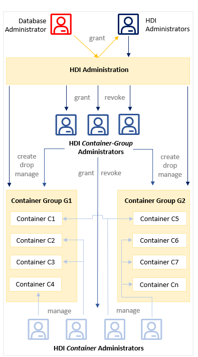

<!-- loiob4b6a8936bc64526b8fd8491c4a40eaa -->

# SAP HDI Administration in Context

An overview of the SAP HANA Deployment Infrastructure \(HDI\) administration process including the administrator users who set up and maintain HDI and its components.

### Database Administrator

The database administrator `DBADMIN` is needed for creating an HDI administrator and granting the new HDI administrator the permissions required to maintain HDI.

> ### Note:  
> `DBADMIN` user privileges are required to create the first HDI administrator, who can then create other HDI administrators. After creation of the first HDI administrator, the `DBADMIN` user can be deactivated.

### HDI Administrators

Created by the database administrator, the HDI administrator is responsible for the setup and overall maintenance of HDI.

The role of the HDI administrator includes the following tasks:

-   Configuring general HDI parameters

-   Maintaining containers and container groups, for example, by creating and dropping containers and container groups

-   Managing container-group administrator privileges, for example, by granting and revoking HDI container-group access permissions

### HDI Administration

HDI provides its services using a separate database process named `diserver`, which is enabled by default in SAP HANA Cloud. If required by the usage scenario, other database process may also need to be started as well.

The database administrator `DBADMIN` is needed for creating an HDI administrator, who then performs the tasks required to set up and maintain other HDI administrators, if required.

> ### Note:  
> `DBADMIN` user privileges are required to create the first HDI administrator, who can then create other HDI administrators. After creation of the first HDI administrator, the `DBADMIN` user can be deactivated.

The HDI administrator is responsible for the setup and overall maintenance of HDI as well as configuring high-level HDI parameters, and maintaining containers and container groups. However, the everyday management and maintenance of containers and container groups is usually passed on to the container and container-group administrators respectively.

The HDI container-group administrator manages a set of containers in container groups assigned by the HDI administrator. Container-group management includes granting and revoking access to containers and container-groups and maintaining these container groups.

The HDI container administrator manages one or more containers assigned by the container-group administrator, for example, individual containers in one or more container groups or a combination of containers across multiple container groups.

### HDI Container-Group Administrator

The administrator of an HDI **container group** is responsible for managing the set of HDI containers configured in the container groups assigned by the HDI administrator. HDI container groups are logical collections of the HDI containers used to store the database objects deployed by the SAP HANA Deployment Infrastructure deploy service. The HDI container-group administrator, in turn, creates containers which can then be assigned to the HDI container administrator.

An HDI container-group administrator typically performs the following tasks:

-   Granting and revoking container \(and container-group\) **administrator** access privileges

-   Importing and exporting containers \(for example, for support purposes\)

-   Granting and revoking container **user** access privileges \(for example, for support purposes\)

-   Maintaining container groups \(and the containers assigned to the groups\)

> ### Tip:  
> The APIs of a container group “G” are in the `_SYS_DI#G` schema.

### HDI Container Groups

HDI container groups are logical collections of the HDI containers used to store the database objects deployed by the SAP HANA Deployment Infrastructure deploy service.

> ### Tip:  
> Container groups are intended to make life easier when multiple administrators require access to containers from different contexts, for example, ABAP or other development groups working in native SAP HANA contexts.

The HDI administrator can create container groups for a target audience whose container-related requirements are unique or where there is an obvious benefit for a logical separation, for example, between ABAP and applications running in the SAP HANA environment.

After creation, an HDI container group can be assigned to a dedicated HDI container-group administrator, to whom the HDI administrator must grant the privileges required to perform the typical tasks associated with the administration of container group, for example: granting and revoking container \(and container-group\) access privileges; and maintaining container groups \(and the containers assigned to the groups\).

> ### Restriction:  
> HDI enables you to deploy database objects only; it is not possible \(or necessary\) to use the HDI to deploy application-layer artifacts such as JavaScript programs or OData objects.

### HDI Containers

The SAP HANA Deployment Infrastructure \(HDI\) provides a service that enables you to deploy database development artifacts to so-called HDI containers. This service includes a family of consistent design-time artifacts for all key SAP HANA platform database features which describe the target \(run-time\) state of SAP HANA database artifacts, for example: tables, views, or procedures. These artifacts are modeled, staged \(uploaded\), built, and deployed into SAP HANA.

> ### Restriction:  
> HDI enables you to deploy database objects only; it is not possible \(or necessary\) to use the HDI to deploy application-layer artifacts such as JavaScript programs or OData objects.

The SAP HANA service broker is used to create and destroy HDI containers; each HDI container comprises a design-time container \(an isolated environment for design-time files\) and a run-time container, which is used to store the deployed objects built according to the specification stored in the corresponding design-time artifacts. Although this isolation is designed and implement by default, it is possible to use a combination of roles and synonyms to enable cross-container access; that is, to provide objects in one container with access to schemas and objects in another "foreign" container.

> ### Tip:  
> HDI uses so-called build plug-ins to create run-time objects from the corresponding design-time files, for example, a procedure object in the database catalog is created from a design-time definition of a stored procedure. For more information about HDI build plug-ins, see *Related Information* below.

### HDI Container Administrator

The HDI container administrator manages the content of one or more HDI containers, which are assigned by the container-group administrator.

The container-management role focuses primarily on configuring and controlling access to the HDI containers used to store the database objects deployed by the SAP HANA Deployment Infrastructure deploy service. Container administrators need access to containers in order to be able to clean up and repair problems with run-time objects.

> ### Note:  
> An HDI container administrator can manage one or more containers in one HDI container group or multiple containers distributed across multiple container groups.

The HDI container administrator typically performs the following tasks:

-   Granting and revoking container access privileges for container **administrators**

-   Configuring container libraries and parameters

-   Granting and revoking roles to and from users

-   Granting and revoking user access to container schemas

-   Repair problems with run-time objects

> ### Tip:  
> The APIs of a container “C” are in the `C#DI` schema.

**Related Information**  

[Enabling the SAP HDI Administrators](12-HDI-Cloud-Admin-Enable-Admins/enabling-the-sap-hdi-administrators-c248d55.md "Create the users required to adminstrate and maintain the SAP HANA Deployment Infrastructure (HDI) services.")

[Maintaining the SAP HDI](13-HDI-Cloud-Admin-Maintain-HDI/maintaining-the-sap-hdi-df043e3.md "Maintenance of the SAP HANA Deployment infrastructure (HDI) is the responsibility of the HDI administrator, who must set up and configure general HDI parameters.")

[Maintaining SAP HDI Container Groups](14-HDI-Cloud-Admin-Maintain-Container-Groups/maintaining-sap-hdi-container-groups-4e9d597.md "The administrator of an SAP HDI container group is responsible for managing the SAP HDI containers that are organized into one or more HDI container groups.")

[Maintaining SAP HDI Containers](15-HDI-Cloud-Admin-Maintain-Containers/maintaining-sap-hdi-containers-bcd6e27.md "An HDI container administrator configures and controls access to a SAP HDI container.")

[SAP HDI Artifact Types and Build Plug-ins Reference](../30-HDI-Cloud-Artifact-Types/sap-hdi-artifact-types-and-build-plug-ins-reference-9789224.md "The SAP HANA Cloud, SAP HANA database deployment infrastructure (HDI) supports a wide variety of database artifact types, for example, tables, indexes, and views.")

