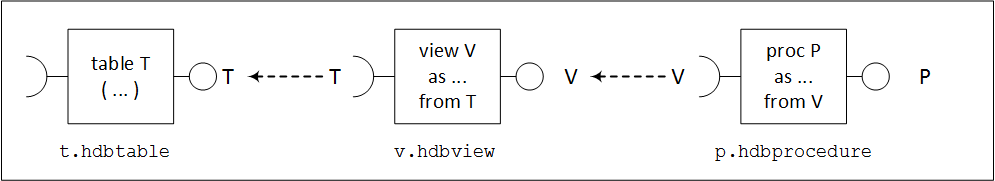

<!-- loiodc12a28ad4bc49279d7f59744c3a2b1b -->

# GET\_DEPENDENCIES

Retrieve dependency data for objects and groups.


The SAP HDI Container API includes the `GET_DEPENDENCIES` command, which enables you to retrieve dependency data; the kind of data that is retrieved depends on the optional "variant" parameter passed in `PARAMETERS`.


<a name="loiodc12a28ad4bc49279d7f59744c3a2b1b__section_ylt_tjw_f2b"/>

## Signature

> ### Sample Code:  
> ```sql
> GET_DEPENDENCIES
>  ( 
>   IN   OBJECTS      _SYS_DI.TT_OBJECTS,
>   IN   PARAMETERS   _SYS_DI.TT_PARAMETERS, 
>   OUT  RETURN_CODE  INT, 
>   OUT  REQUEST_ID   BIGINT, 
>   OUT  MESSAGES     _SYS_DI.TT_MESSAGES,
>   OUT  RESULT       _SYS_DI.TT_DEPENDENCIES
>  ) 
> ```


<a name="loiodc12a28ad4bc49279d7f59744c3a2b1b__section_gg2_zfw_f2b"/>

## Parameters

The following parameters can be used with `IN` and `OUT` parameters in the `GET_DEPENDENCIES` command:


### OBJECTS \[IN\]

The Objects for which dependency data should be retrieved:

**\_SYS\_DI.TT\_OBJECTS**


<table>
<tr>
<th valign="top">

Name

</th>
<th valign="top">

Data Type

</th>
<th valign="top">

Description

</th>
</tr>
<tr>
<td valign="top">

DOMAIN

</td>
<td valign="top">

NVARCHAR\(256\)

</td>
<td valign="top">

Domain of the object to be queried.

-   ' ': An empty string indicates that the object is a file in the HDI container's deployed file system

-   'db': Indicates that the object is a database object in the HDI container


</td>
</tr>
<tr>
<td valign="top">

URI

</td>
<td valign="top">

NVARCHAR\(510\)

</td>
<td valign="top">

Unique resource identifier of the object.

-   A file path, if the object is the deployed file system in the container

-   An object name, if the object is a database object in the container


</td>
</tr>
</table>


### PARAMETERS \[IN\]

Additional parameters can be used to control various aspects of the procedure execution. If no parameters are needed, the empty predefined parameters table `_SYS_DI.T_NO_PARAMETERS` can be used.

**\_SYS\_DI.TT\_PARAMETERS**


<table>
<tr>
<th valign="top">

Name

</th>
<th valign="top">

Data Type

</th>
<th valign="top">

Description

</th>
</tr>
<tr>
<td valign="top">

KEY

</td>
<td valign="top">

NVARCHAR\(256\)

</td>
<td valign="top">

The key name of the parameter

</td>
</tr>
<tr>
<td valign="top">

VALUE

</td>
<td valign="top">

NVARCHAR\(256\)

</td>
<td valign="top">

The value assigned to the parameter

</td>
</tr>
</table>

The following additional parameters are available:

-   `container_lock_wait_timeout`

-   `trace_context`

-   `trace_level.<trace topic>`

-   `variant`:

    -   `providers` \(default\)

        Returns for the given objects the files providing them

    -   `provides_and_requires`

        Returns for the given files the provided and required objects

    -   `depends`

        Returns for the given files the files they directly depend on

    -   `impacted`

        Returns for the given files the files that directly depend on them


-   `message_severity`


> ### Tip:  
> For more information about all available SAP HANA HDI parameters, see *Available SAP HDI Parameters* in *Related Information* below.


### RETURN\_CODE \[OUT\]

The return code indicates if the procedure executed successfully. For more details about which codes are returned, see *The SQL API for SAP HDI* in *Related Information*.


### REQUEST\_ID \[OUT\]

A unique ID is generated for each HDI container API call. For more details about which IDs are generated for API calls, see *The SQL API for SAP HDI* in *Related Information*.


### MESSAGES \[OUT\]

A table is used to display messages that contain information logged during \(and about\) the execution of the procedure. For more details about which codes are returned, see *The SQL API for SAP HDI* in *Related Information*.


### 

Returns the dependency information for the queried objects. Depending on the used variant, some of the fields may not contain data:RESULT \[OUT\]

**\_SYS\_DI.TT\_DEPENDENCIES**


<table>
<tr>
<th valign="top">

Name

</th>
<th valign="top">

Data Type

</th>
<th valign="top">

Description

</th>
</tr>
<tr>
<td valign="top">

OBJECT\_DOMAIN

</td>
<td valign="top">

NVARCHAR\(256\)

</td>
<td valign="top">

The domain where the object is located

</td>
</tr>
<tr>
<td valign="top">

OBJECT\_NAME

</td>
<td valign="top">

NVARCHAR\(510\)

</td>
<td valign="top">

Unique resource identifier of the object

</td>
</tr>
<tr>
<td valign="top">

DEPENDENCY\_DOMAIN

</td>
<td valign="top">

NVARCHAR\(256\)

</td>
<td valign="top">

RESULT \[OUTThe domain where the dependency is located

</td>
</tr>
<tr>
<td valign="top">

DEPENDENCY\_NAME

</td>
<td valign="top">

NVARCHAR\(510\)

</td>
<td valign="top">

Unique resource identifier of the dependency

</td>
</tr>
<tr>
<td valign="top">

DEPENDENCY\_TYPE

</td>
<td valign="top">

NVARCHAR\(20\)

</td>
<td valign="top">

For the "`providers`" variant, indicates the type of the dependency:

-   PROVIDE\_RT

    Provides an object with the name `DEPENDENCY_NAME` 

-   REQUIRE\_DEPLOY

    Has a dependency on an object with the name `DEPENDENCY_NAME` 


</td>
</tr>
<tr>
<td valign="top">

DEPENDENCY\_LOCATION

</td>
<td valign="top">

NVARCHAR\(100\)

</td>
<td valign="top">

For the "`providers`" variant, returns the line and column location of the dependency in the object. The type of location returned depends on the object type

</td>
</tr>
<tr>
<td valign="top">

DEPENDENCY\_LOCATION\_PATH

</td>
<td valign="top">

NVARCHAR\(5000\)

</td>
<td valign="top">

For the "`providers`" variant, returns a path to the location of the dependency in the object. The type of location path returned depends on the object type.

</td>
</tr>
</table>


<a name="loiodc12a28ad4bc49279d7f59744c3a2b1b__section_gz2_dz3_w2b"/>

## Examples

In this example, the following files should be deployed to container C's deployed file system:

-   `t.hdbtable`

    Defines a table T.

-   `v.hdbview`

    Defines a view V that selects from table T, which means that `v.hdbview` depends on `t.hdbtable`.

-   `p.hdbprocedure`

    Defines a procedure P that depends on `v.hdbview` \(which depends on `t.hdbtable`\).




If not already present, the dependent files listed above first must be written to the container's work file system using the `WRITE` API. For the sake of completeness, the HDI configuration files `.hdiconfig` and `.hdinamespace` are also included.

> ### Sample Code:  
> Write Folders and Files to an HDI Container's Work File System
> 
> ```sql
> CREATE LOCAL TEMPORARY COLUMN TABLE #PATHS LIKE _SYS_DI.TT_FILESFOLDERS_CONTENT;
> INSERT INTO #PATHS (PATH, CONTENT) VALUES ('.hdiconfig', '{ "file_suffixes" : { "hdbtable" : { "plugin_name" : "com.sap.hana.di.table" }, "hdbview" : { "plugin_name" : "com.sap.hana.di.view" }, "hdbprocedure" : { "plugin_name" : "com.sap.hana.di.procedure" } } }');
> INSERT INTO #PATHS (PATH, CONTENT) VALUES ('.hdinamespace', '{ "name": "", "subfolder": "ignore" }');
> INSERT INTO #PATHS (PATH, CONTENT) VALUES ('t.hdbtable', 'COLUMN TABLE T ( A INTEGER )');
> INSERT INTO #PATHS (PATH, CONTENT) VALUES ('v.hdbview', 'VIEW V AS SELECT A FROM T');
> INSERT INTO #PATHS (PATH, CONTENT) VALUES ('p.hdbprocedure', 'PROCEDURE P (OUT RESULT INT) LANGUAGE SQLSCRIPT AS BEGIN SELECT COUNT(*) INTO RESULT FROM V; end');
> CALL C#DI.WRITE(#PATHS, _SYS_DI.T_NO_PARAMETERS, ?, ?, ?);
> DROP TABLE #PATHS;
> ```

The following example shows how to deploy the files to the database:

> ### Sample Code:  
> Deploy Files
> 
> ```sql
> CREATE LOCAL TEMPORARY COLUMN TABLE #DEPLOY_PATHS LIKE _SYS_DI.TT_FILESFOLDERS;
> INSERT INTO #DEPLOY_PATHS (PATH) VALUES ('.hdiconfig');
> INSERT INTO #DEPLOY_PATHS (PATH) VALUES ('.hdinamespace');
> INSERT INTO #DEPLOY_PATHS (PATH) VALUES ('t.hdbtable');
> INSERT INTO #DEPLOY_PATHS (PATH) VALUES ('v.hdbview');
> INSERT INTO #DEPLOY_PATHS (PATH) VALUES ('p.hdbprocedure');
> CREATE LOCAL TEMPORARY COLUMN TABLE #UNDEPLOY_PATHS LIKE _SYS_DI.TT_FILESFOLDERS;
> CREATE LOCAL TEMPORARY COLUMN TABLE #PATH_PARAMETERS LIKE _SYS_DI.TT_FILESFOLDERS_PARAMETERS;
> CALL C#DI.MAKE(#DEPLOY_PATHS, #UNDEPLOY_PATHS, #PATH_PARAMETERS, _SYS_DI.T_NO_PARAMETERS, ?, ?, ?);
> DROP TABLE #DEPLOY_PATHS;
> DROP TABLE #UNDEPLOY_PATHS;
> DROP TABLE #PATH_PARAMETERS; 
> ```

The dependency relationship at the file \(and object\) level can be extracted using the `GET_DEPENDENCIES` procedure. The following examples shows what the returned results looks like:

> ### Tip:  
> The `variant` parameter determines the type of dependency information being queried, for example, “providers” \(default\) or “provides and requires”. For more information about the variant parameter, see `_SYS_DI.TT_PARAMETERS` in [Parameters \[IN\]](get-dependencies-dc12a28.md#loiodc12a28ad4bc49279d7f59744c3a2b1b__subsection_u2h_ndk_w2b).


### Variant Parameter: Providers

In this variant, the command returns, for the given objects, the files providing them. In this example, the names of the database objects T, V, P \(domain is `db`\) are passed into the procedure, which then returns the paths of the design-time files that contain the definitions from which the specified database objects were created.

> ### Sample Code:  
> Call `#DI.GET_DEPENDENCIES` \(`providers`\)
> 
> ```sql
> CREATE LOCAL TEMPORARY TABLE #OBJECTS LIKE _SYS_DI.TT_OBJECTS;
> CREATE LOCAL TEMPORARY TABLE #PARAMETERS LIKE _SYS_DI.TT_PARAMETERS;
> INSERT INTO #OBJECTS (DOMAIN, URI) VALUES ('db', 'T');
> INSERT INTO #OBJECTS (DOMAIN, URI) VALUES ('db', 'V');
> INSERT INTO #OBJECTS (DOMAIN, URI) VALUES ('db', 'P');
> INSERT INTO #PARAMETERS (KEY, VALUE) VALUES ('variant', 'providers');
> CALL C#DI.GET_DEPENDENCIES(#OBJECTS, #PARAMETERS, ?, ?, ?, ?);
> DROP TABLE #OBJECTS; 
> DROP TABLE #PARAMETERS; 
> ```

> ### Output Code:  
> Call `#DI.GET_DEPENDENCIES` Results \(`providers`\)
> 
> ```sql
> 
> OBJECT_  OBJECT_  DEPENDENCY_  DEPENDENCY_    DEPENDENCY_  DEPENDENCY_  DEPENDENCY_
> DOMAIN   NAME     DOMAIN       NAME           TYPE         LOCATION     LOCATION_PATH
> ––––––––––––––––––––––––––––––––––––––––––––––––––––––-––––––––––––––––-–––-–––––––––
> db       P                     p.hdbprocedure              1:11-12
> db       T                     t.hdbtable                  1:14-15
> db       V                     v.hdbview                   1:6-7
> ```


### Variant Parameter: Provides and Requires

In this variant, the command returns, for the given files, the provided and required objects. In this example, the paths of the design-time files are passed into the procedure, which then returns information about the database objects that each of the design-time files creates \(provides\) or needs \(requires\) at the time of their deployment. Here, `p.hdbprocedure` provides an object “P” and requires an object “V”; `v.hdbview` provides an object “V” and requires an object “T”; `t.hdbtable` provides an object “T”.

> ### Sample Code:  
> Call `#DI.GET_DEPENDENCIES` \(`provides_and_requires`\)
> 
> ```sql
> CREATE LOCAL TEMPORARY TABLE #OBJECTS LIKE _SYS_DI.TT_OBJECTS;
> CREATE LOCAL TEMPORARY TABLE #PARAMETERS LIKE _SYS_DI.TT_PARAMETERS;
> INSERT INTO #OBJECTS (DOMAIN, URI) VALUES ('', 't.hdbtable');
> INSERT INTO #OBJECTS (DOMAIN, URI) VALUES ('', 'v.hdbview');
> INSERT INTO #OBJECTS (DOMAIN, URI) VALUES ('', 'p.hdbprocedure');
> INSERT INTO #PARAMETERS (KEY, VALUE) VALUES ('variant', 'provides_and_requires'); 
> CALL C#DI.GET_DEPENDENCIES(#OBJECTS, #PARAMETERS, ?, ?, ?, ?);
> DROP TABLE #OBJECTS; 
> DROP TABLE #PARAMETERS; 
> ```

> ### Output Code:  
> `#DI.GET_DEPENDENCIES` Results \(`provides_and_requires`\)
> 
> ```sql
> 
> OBJECT_  OBJECT_         DEPENDENCY_  DEPENDENCY_  DEPENDENCY_     DEPENDENCY_  DEPENDENCY_
> DOMAIN   NAME            DOMAIN       NAME         TYPE            LOCATION     LOCATION_PATH
> ---------------------------------------------------------------------------------------------
>          p.hdbprocedure  db           P            PROVIDE_RT      1:11-12
>          p.hdbprocedure  db           V            REQUIRE_DEPLOY  4:17-18
>          t.hdbtable      db           T            PROVIDE_RT      1:14-15
>          v.hdbview       db           T            REQUIRE_DEPLOY  2:15-16
>          v.hdbview       db           V            PROVIDE_RT      1:6-7
> ```


### Variant Parameter: Depends

In this variant, the command returns, for the given objects, the files they directly depend on. The paths of the design-time files are passed into the procedure, which then returns the paths of the design-time files that they depend on. In this example, `p.hdbprocedure` depends on `v.hdbview`, and `v.hdbview` depends on `t.hdbtable`.

> ### Sample Code:  
> Call `#DI.GET_DEPENDENCIES` \(`depends`\)
> 
> ```sql
> CREATE LOCAL TEMPORARY TABLE #OBJECTS LIKE _SYS_DI.TT_OBJECTS;
> CREATE LOCAL TEMPORARY TABLE #PARAMETERS LIKE _SYS_DI.TT_PARAMETERS;
> INSERT INTO #OBJECTS (DOMAIN, URI) VALUES ('', 't.hdbtable');
> INSERT INTO #OBJECTS (DOMAIN, URI) VALUES ('', 'v.hdbview');
> INSERT INTO #OBJECTS (DOMAIN, URI) VALUES ('', 'p.hdbprocedure'); 
> INSERT INTO #PARAMETERS (KEY, VALUE) VALUES ('variant', 'depends');
> CALL C#DI.GET_DEPENDENCIES(#OBJECTS, #PARAMETERS, ?, ?, ?, ?);
> DROP TABLE #OBJECTS; 
> DROP TABLE #PARAMETERS; 
> ```

> ### Output Code:  
> `#DI.GET_DEPENDENCIES` Results \(`depends`\)
> 
> ```sql
> 
> OBJECT_  OBJECT_         DEPENDENCY_  DEPENDENCY_  DEPENDENCY_   DEPENDENCY_  DEPENDENCY_
> DOMAIN   NAME            DOMAIN       NAME         TYPE          LOCATION     LOCATION_PATH
> --------------------------------------------------------------------------------------------
>          p.hdbprocedure               v.hdbview                               ?
>          v.hdbview                    t.hdbtable                              ?
> ```


### Variant Parameter: Impacted

In this variant, the command returns, for the given objects, the files they directly depend on. The paths of the design-time files are passed into the procedure, which then returns the paths of the design-time files that have a dependency to them. Here, `t.hdbtable` has a dependent \(impacted\) object in `v.hdbview`, and `v.hdbview` has a dependent object in `p.hdbprocedure`.

> ### Sample Code:  
> Call `#DI.GET_DEPENDENCIES` \(`impacted`\)
> 
> ```sql
> CREATE LOCAL TEMPORARY TABLE #OBJECTS LIKE _SYS_DI.TT_OBJECTS;
> CREATE LOCAL TEMPORARY TABLE #PARAMETERS LIKE _SYS_DI.TT_PARAMETERS;
> INSERT INTO #OBJECTS (DOMAIN, URI) VALUES ('', 't.hdbtable');
> INSERT INTO #OBJECTS (DOMAIN, URI) VALUES ('', 'v.hdbview');
> INSERT INTO #OBJECTS (DOMAIN, URI) VALUES ('', 'p.hdbprocedure'); 
> INSERT INTO #PARAMETERS (KEY, VALUE) VALUES ('variant', 'impacted');
> CALL C#DI.GET_DEPENDENCIES(#OBJECTS, #PARAMETERS, ?, ?, ?, ?);
> DROP TABLE #OBJECTS; 
> DROP TABLE #PARAMETERS; 
> ```

> ### Output Code:  
> `#DI.GET_DEPENDENCIES` Results \(`impacted`\)
> 
> ```sql
> 
> OBJECT_  OBJECT_         DEPENDENCY_  DEPENDENCY_  DEPENDENCY_   DEPENDENCY_  DEPENDENCY_
> DOMAIN   NAME            DOMAIN       NAME         TYPE          LOCATION     LOCATION_PATH
> --------------------------------------------------------------------------------------------
>          t.hdbtable                   v.hdbview                               ?
>          v.hdbview                    p.hdbprocedure                          ?
> ```

**Related Information**  


[WRITE](write-bfd0969.md "Write or create files or folders in an HDI container.")

[MAKE](make-7a0b4c5.md "Trigger a make operation in an HDI container with a specified set of files or folders.")

[The HDI Container API](the-hdi-container-api-40ba784.md "Maintain HDI containers and container content using the HDI container API.")

[The SQL API for SAP HANA Deployment Infrastructure \(HDI\)](../the-sql-api-for-sap-hana-deployment-infrastructure-hdi-035dbbe.md "An SQL application programming interface (API) is available to help maintain the SAP HANA Deployment Infrastructure (HDI).")

[Available SAP HDI Parameters](https://help.sap.com/docs/HANA_CLOUD_DATABASE/c2cc2e43458d4abda6788049c58143dc/e2d3e543067e4f3282bf6dbf880c6b2d.html?version=2023_3_QRC#available-sap-hdi-parameters)

