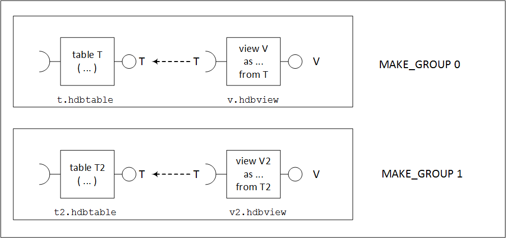

<!-- loiod8b856bd37704c10be52621bd03400d1 -->

# GET\_MAKE\_GROUPS

Calculate the groups of objects that could be passed to a make call.


The SAP HDI Container API includes the `GET_MAKE_GROUPS` command, which enables you to calculate groups of objects that do not have dependencies with each other and could be passed to a make call individually.


<a name="loiod8b856bd37704c10be52621bd03400d1__section_ylt_tjw_f2b"/>

## Signature

> ### Sample Code:  
> ```sql
> GET_MAKE_GROUPS 
>  ( 
>   IN   DEPLOY_PATHS    _SYS_DI.TT_FILESFOLDERS, 
>   IN   UNDEPLOY_PATHS  _SYS_DI.TT_FILESFOLDERS, 
>   IN   PATH_PARAMETERS _SYS_DI.TT_FILESFOLDERS_PARAMETERS,
>   IN   PARAMETERS      _SYS_DI.TT_PARAMETERS, 
>   OUT  RETURN_CODE     INT, 
>   OUT  REQUEST_ID      BIGINT, 
>   OUT  MESSAGES        _SYS_DI.TT_MESSAGES
>  ) 
> ```


<a name="loiod8b856bd37704c10be52621bd03400d1__section_gg2_zfw_f2b"/>

## Parameters

The following parameters can be used with `IN` and `OUT` parameters in the `GET_MAKE_GROUPS` command:


### DEPLOY\_PATHS \[IN\]

Specifies a list of files or folders to be deployed:

**\_SYS\_DI.TT\_FILESFOLDERS**


<table>
<tr>
<th valign="top">

Name

</th>
<th valign="top">

Data Type

</th>
<th valign="top">

Description

</th>
</tr>
<tr>
<td valign="top">

PATH

</td>
<td valign="top">

NVARCHAR\(511\)

</td>
<td valign="top">

A single path is either a fully qualified path to a file \(for example, `/path/to/a/file.txt`'\), or a fully qualified path to a folder \(for example, `/path/to/`\).

</td>
</tr>
</table>


### UNDEPLOY\_PATHS \[IN\]

Specifies a list of files or folders to be **un**deployed:

**\_SYS\_DI.TT\_FILESFOLDERS**


<table>
<tr>
<th valign="top">

Name

</th>
<th valign="top">

Data Type

</th>
<th valign="top">

Description

</th>
</tr>
<tr>
<td valign="top">

PATH

</td>
<td valign="top">

NVARCHAR\(511\)

</td>
<td valign="top">

A single path is either a fully qualified file path \(for example, `/path/to/a/file.txt`'\), or a fully qualified folder path \(for example, `/path/to/`\).

</td>
</tr>
</table>


### PATH\_PARAMETERS \[IN\]

The following table lists path parameters you can use with the `GET_MAKE_GROUPS` command at the file or folder level:

**\_SYS\_DI.TT\_FILESFOLDERS\_PARAMETERS**


<table>
<tr>
<th valign="top">

Name

</th>
<th valign="top">

Data Type

</th>
<th valign="top">

Description

</th>
</tr>
<tr>
<td valign="top">

PATH

</td>
<td valign="top">

NVARCHAR\(511\)

</td>
<td valign="top">

A single path is either a fully qualified file path \(for example, `/path/to/a/file.txt`'\), or a fully qualified folder path \(for example, `/path/to/`\).

</td>
</tr>
<tr>
<td valign="top">

KEY

</td>
<td valign="top">

NVARCHAR\(256\)

</td>
<td valign="top">

The key name of the parameter

</td>
</tr>
<tr>
<td valign="top">

VALUE

</td>
<td valign="top">

NVARCHAR\(256\)

</td>
<td valign="top">

The value assigned to the parameter

</td>
</tr>
</table>


### PARAMETERS \[IN\]

Additional parameters can be used to control various aspects of the procedure execution. If no parameters are needed, the empty predefined parameters table `_SYS_DI.T_NO_PARAMETERS` can be used.

**\_SYS\_DI.TT\_PARAMETERS**


<table>
<tr>
<th valign="top">

Name

</th>
<th valign="top">

Data Type

</th>
<th valign="top">

Description

</th>
</tr>
<tr>
<td valign="top">

KEY

</td>
<td valign="top">

NVARCHAR\(256\)

</td>
<td valign="top">

The key name of the parameter

</td>
</tr>
<tr>
<td valign="top">

VALUE

</td>
<td valign="top">

NVARCHAR\(256\)

</td>
<td valign="top">

The value assigned to the parameter

</td>
</tr>
</table>

The following additional parameters are available:

-   `container_lock_wait_timeout`

-   `max_parallel_jobs`

-   `optimized_redeploy`

-   `skip_unchanged_expansions`

-   `trace_context`

-   `trace_level.<trace topic>`

-   `treat_warnings_as_errors`

-   `undeploy_dependent_recursively`

-   `use_redeploy_for_unchanged`

-   `message_severity`


> ### Tip:  
> For more information about all available SAP HANA HDI parameters, see *Available SAP HDI Parameters* in *Related Information* below.


### RETURN\_CODE \[OUT\]

The return code indicates if the procedure executed successfully. For more details about which codes are returned, see *The SQL API for SAP HDI* in *Related Information*.


### REQUEST\_ID \[OUT\]

A unique ID is generated for each HDI container API call. For more details about which IDs are generated for API calls, see *The SQL API for SAP HDI* in *Related Information*.


### MESSAGES \[OUT\]

A table is used to display messages that contain information logged during \(and about\) the execution of the procedure. For more details about which codes are returned, see *The SQL API for SAP HDI* in *Related Information*.


### RESULT \[OUT\]

Returns a table listing the independent MAKE groups, as follows:

**\_SYS\_DI.TT\_MAKE\_GROUPS**


<table>
<tr>
<th valign="top">

Name

</th>
<th valign="top">

Data Type

</th>
<th valign="top">

Description

</th>
</tr>
<tr>
<td valign="top">

MAKE\_GROUP

</td>
<td valign="top">

BIGINT

</td>
<td valign="top">

An identifier for a make group which is assigned to every path

</td>
</tr>
<tr>
<td valign="top">

PATH

</td>
<td valign="top">

NVARCHAR\(511\)

</td>
<td valign="top">

A single path is either a fully qualified file path \(for example, `'a/path/to/a/file.txt`\), or a fully qualified folder path \(for example, `a/path/to/a/folder`\).

</td>
</tr>
</table>


<a name="loiod8b856bd37704c10be52621bd03400d1__section_gz2_dz3_w2b"/>

## Examples

In this example, the following files should be deployed to container C's deployed file system:

-   `t.hdbtable`

    Defines a table T

-   `v.hdbview`

    Defines a view V that selects from table T, which means that `v.hdbview` depends on `t.hdbtable`

-   `t2.hdbtable`

    Defines a table T2

-   `v2.hdbview`

    Defines a view V2 that selects from table T2, which means `v2.hdbview` depends on `t2.hdbtable`.




In this example, there are two sets of files \(make groups\) which could be deployed independently of each other, using the `MAKE` API. If necessary, the files first have to be written to the container's work file system using the `WRITE` API. For the sake of completeness, the HDI configuration files `.hdiconfig` and `.hdinamespace` are also included.

> ### Sample Code:  
> Write Folders and Files to an HDI Container's Work File System
> 
> ```sql
> CREATE LOCAL TEMPORARY COLUMN TABLE #PATHS LIKE _SYS_DI.TT_FILESFOLDERS_CONTENT;
> INSERT INTO #PATHS (PATH, CONTENT) VALUES ('.hdiconfig', '{ "file_suffixes" : { "hdbtable" : { "plugin_name" : "com.sap.hana.di.table" }, "hdbview" : { "plugin_name" : "com.sap.hana.di.view" }, "hdbprocedure" : { "plugin_name" : "com.sap.hana.di.procedure" } } }');
> INSERT INTO #PATHS (PATH, CONTENT) VALUES ('.hdinamespace', '{ "name": "", "subfolder": "ignore" }');
> INSERT INTO #PATHS (PATH, CONTENT) VALUES ('src1/', NULL);
> INSERT INTO #PATHS (PATH, CONTENT) VALUES ('src1/t.hdbtable', 'COLUMN TABLE T ( A INTEGER )');
> INSERT INTO #PATHS (PATH, CONTENT) VALUES ('src1/v.hdbview', 'VIEW V AS SELECT A FROM T');
> INSERT INTO #PATHS (PATH, CONTENT) VALUES ('src2/', '');
> INSERT INTO #PATHS (PATH, CONTENT) VALUES ('src2/p.hdbprocedure', 'PROCEDURE P (OUT RESULT INT) LANGUAGE SQLSCRIPT AS BEGIN SELECT COUNT(*) INTO RESULT FROM V; end');
> CALL <container name>#DI.WRITE(#PATHS, _SYS_DI.T_NO_PARAMETERS, ?, ?, ?);
> DROP TABLE #PATHS;
> ```

To determine the independent make groups, you can call `GET_MAKE_GROUPS`, which takes the same input parameters as a `MAKE` call. `GET_MAKE_GROUPS` considers `DEPLOY_PATHS` and `UNDEPLOY_PATHS`.

> ### Sample Code:  
> Display the MAKE Groups \(`DI#.GET_MAKE_GROUPS`\)
> 
> ```sql
> CREATE LOCAL TEMPORARY COLUMN TABLE #DEPLOY_PATHS LIKE _SYS_DI.TT_FILESFOLDERS;
> INSERT INTO #DEPLOY_PATHS (PATH) VALUES ('.hdiconfig');
> INSERT INTO #DEPLOY_PATHS (PATH) VALUES ('.hdinamespace');
> INSERT INTO #DEPLOY_PATHS (PATH) VALUES ('t.hdbtable');
> INSERT INTO #DEPLOY_PATHS (PATH) VALUES ('v.hdbview');
> INSERT INTO #DEPLOY_PATHS (PATH) VALUES ('t2.hdbtable');
> INSERT INTO #DEPLOY_PATHS (PATH) VALUES ('v2.hdbview');
> CREATE LOCAL TEMPORARY COLUMN TABLE #UNDEPLOY_PATHS LIKE _SYS_DI.TT_FILESFOLDERS;
> CREATE LOCAL TEMPORARY COLUMN TABLE #PATH_PARAMETERS LIKE _SYS_DI.TT_FILESFOLDERS_PARAMETERS;
> CALL <container name>#DI.GET_MAKE_GROUPS(#DEPLOY_PATHS, #UNDEPLOY_PATHS, #PATH_PARAMETERS, _SYS_DI.T_NO_PARAMETERS, ?, ?, ?, ?);
> DROP TABLE #DEPLOY_PATHS;
> DROP TABLE #UNDEPLOY_PATHS;
> DROP TABLE #PATH_PARAMETERS;
> ```

The following output example shows what the returned results looks like:

> ### Output Code:  
> `C#DI.GET_MAKE_GROUPS` 
> 
> ```sql
> MAKE_GROUP    PATH
> ––––––––––––––––––––––––––
> 0             t.hdbtable
> 0             v.hdbview
> 1             t2.hdbtable
> 1             v2.hdbview 
> ```

The resulting file paths for each `MAKE` group can be used for separate calls to the `MAKE` API.

> ### Remember:  
> Since the `.hdiconfig` and `.hdinamespace` files do not define a database artifact, neither is included in the results returned by the `GET_MAKE_BROUPS` call. For this reason, the `.hdiconfig` and `.hdinamespace` files should be included in the first `MAKE` call, **before** deploying any database artifacts, as illustrated in the following examples:

> ### Sample Code:  
> `MAKE` the `.hdiconfig` and `.hdinamespace` files, if required
> 
> ```sql
> CREATE LOCAL TEMPORARY COLUMN TABLE #DEPLOY_PATHS LIKE _SYS_DI.TT_FILESFOLDERS;
> INSERT INTO #DEPLOY_PATHS (PATH) VALUES ('.hdiconfig');
> INSERT INTO #DEPLOY_PATHS (PATH) VALUES ('.hdinamespace');
> CREATE LOCAL TEMPORARY COLUMN TABLE #UNDEPLOY_PATHS LIKE _SYS_DI.TT_FILESFOLDERS;
> CREATE LOCAL TEMPORARY COLUMN TABLE #PATH_PARAMETERS LIKE _SYS_DI.TT_FILESFOLDERS_PARAMETERS;
> CALL <container name>#DI.MAKE(#DEPLOY_PATHS, #UNDEPLOY_PATHS, #PATH_PARAMETERS, _SYS_DI.T_NO_PARAMETERS, ?, ?, ?);
> DROP TABLE #DEPLOY_PATHS;
> DROP TABLE #UNDEPLOY_PATHS;
> DROP TABLE #PATH_PARAMETERS; 
> ```

> ### Sample Code:  
> `MAKE` Group 0
> 
> ```sql
> CREATE LOCAL TEMPORARY COLUMN TABLE #DEPLOY_PATHS LIKE _SYS_DI.TT_FILESFOLDERS;
> INSERT INTO #DEPLOY_PATHS (PATH) VALUES ('t.hdbtable');
> INSERT INTO #DEPLOY_PATHS (PATH) VALUES ('v.hdbview');
> CREATE LOCAL TEMPORARY COLUMN TABLE #UNDEPLOY_PATHS LIKE _SYS_DI.TT_FILESFOLDERS;
> CREATE LOCAL TEMPORARY COLUMN TABLE #PATH_PARAMETERS LIKE _SYS_DI.TT_FILESFOLDERS_PARAMETERS;
> CALL <container name>#DI.MAKE(#DEPLOY_PATHS, #UNDEPLOY_PATHS, #PATH_PARAMETERS, _SYS_DI.T_NO_PARAMETERS, ?, ?, ?);
> DROP TABLE #DEPLOY_PATHS;
> DROP TABLE #UNDEPLOY_PATHS;
> DROP TABLE #PATH_PARAMETERS;  
> ```

> ### Sample Code:  
> `MAKE` Group 1
> 
> ```sql
> CREATE LOCAL TEMPORARY COLUMN TABLE #DEPLOY_PATHS LIKE _SYS_DI.TT_FILESFOLDERS;
> INSERT INTO #DEPLOY_PATHS (PATH) VALUES ('t2.hdbtable');
> INSERT INTO #DEPLOY_PATHS (PATH) VALUES ('v2.hdbview');
> CREATE LOCAL TEMPORARY COLUMN TABLE #UNDEPLOY_PATHS LIKE _SYS_DI.TT_FILESFOLDERS;
> CREATE LOCAL TEMPORARY COLUMN TABLE #PATH_PARAMETERS LIKE _SYS_DI.TT_FILESFOLDERS_PARAMETERS;
> CALL <container name>#DI.MAKE(#DEPLOY_PATHS, #UNDEPLOY_PATHS, #PATH_PARAMETERS, _SYS_DI.T_NO_PARAMETERS, ?, ?, ?);
> DROP TABLE #DEPLOY_PATHS;
> DROP TABLE #UNDEPLOY_PATHS;
> DROP TABLE #PATH_PARAMETERS;  
> ```

**Related Information**  


[WRITE](write-bfd0969.md "Write or create files or folders in an HDI container.")

[MAKE](make-7a0b4c5.md "Trigger a make operation in an HDI container with a specified set of files or folders.")

[The HDI Container API](the-hdi-container-api-40ba784.md "Maintain HDI containers and container content using the HDI container API.")

[The SQL API for SAP HANA Deployment Infrastructure \(HDI\)](../the-sql-api-for-sap-hana-deployment-infrastructure-hdi-035dbbe.md "An SQL application programming interface (API) is available to help maintain the SAP HANA Deployment Infrastructure (HDI).")

[Available SAP HDI Parameters](https://help.sap.com/docs/HANA_CLOUD_DATABASE/c2cc2e43458d4abda6788049c58143dc/e2d3e543067e4f3282bf6dbf880c6b2d.html?version=2023_3_QRC#available-sap-hdi-parameters)

